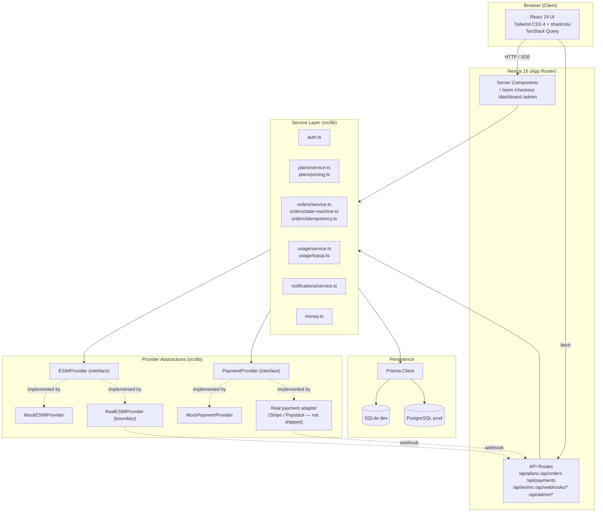
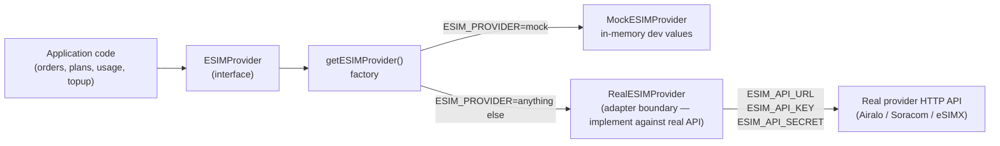
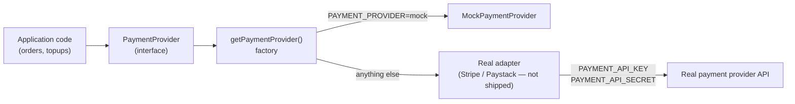
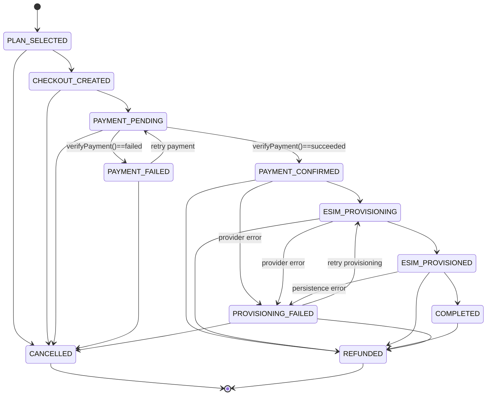
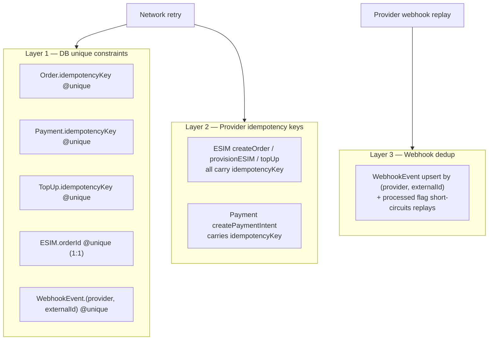
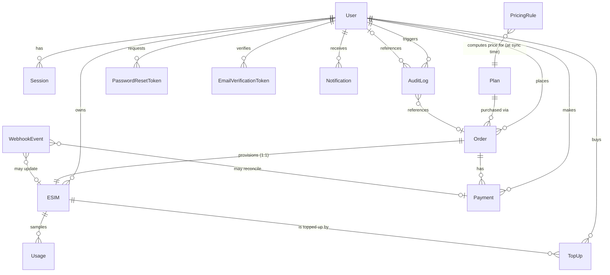

# Architecture

This document describes the high-level architecture of RoamLink, the eSIM
reseller marketplace MVP. It covers the component layout, the provider
abstraction boundaries (eSIM and payment), the order state machine, the
idempotency design, money handling, and the data model.

---

## High-Level Component Diagram



The service layer in `src/lib/*` is the **only** place business logic lives.
Server Components and API routes are thin: they authenticate, call a service,
serialize the result, and respond. Provider adapters normalize provider-native
shapes into canonical types; provider-native data never crosses the adapter
boundary into the service layer.

---

## ESIMProvider Abstraction Boundary

The application talks to eSIM providers only through the `ESIMProvider`
interface defined in
[`src/lib/esim/provider.ts`](../src/lib/esim/provider.ts). A factory
(`src/lib/esim/index.ts`) selects the concrete implementation at runtime from
`process.env.ESIM_PROVIDER`.



### Why a boundary?

- **No vendor lock-in.** Swapping providers is one env var + one adapter file.
- **No leaky abstractions.** Provider-native JSON shapes are normalized into
  `CanonicalPlan` / `ProvisioningResult` / `UsageSample` / `TopUpPackage` /
  `TopUpResult` / `ProviderWebhookEvent`. The rest of the application never
  imports provider-specific types.
- **Mock parity.** `MockESIMProvider` implements the same interface, so dev
  code paths exercise the exact same code as production paths.
- **No fabrication.** `RealESIMProvider` is a structural boundary only — every
  method throws "not implemented" until you implement it against a real
  provider's documented HTTP API. We never fabricate provider APIs.

### Interface surface

```ts
interface ESIMProvider {
  readonly id: string;
  readonly label: string;
  readonly isMock: boolean;

  getPlans(): Promise<ProviderPlanInput[]>;
  getPlan(providerPlanId: string): Promise<ProviderPlanInput | null>;

  createOrder(input: {
    providerPlanId: string;
    idempotencyKey: string;
  }): Promise<{ providerOrderId: string }>;

  provisionESIM(input: {
    providerOrderId: string;
    idempotencyKey: string;
  }): Promise<ProvisioningResult>;

  getESIM(providerESIMId: string): Promise<{...}>;
  getUsage(providerESIMId: string): Promise<UsageSample>;

  supportsTopUp(providerESIMId: string): Promise<boolean>;
  getTopUpPackages(providerESIMId: string): Promise<TopUpPackage[]>;
  topUp(input: {
    providerESIMId: string;
    packageId: string;
    idempotencyKey: string;
  }): Promise<TopUpResult>;

  cancel(providerESIMId: string): Promise<void>;

  verifyWebhook(input: {
    signature: string | null;
    rawBody: string;
  }): Promise<ProviderWebhookEvent | null>;
}
```

Every state-changing method (`createOrder`, `provisionESIM`, `topUp`) takes an
`idempotencyKey`. Adapters MUST return the same result for the same key on
retry instead of duplicating the side effect. See
[`esim-provider.md`](esim-provider.md) for the full method-by-method contract.

---

## PaymentProvider Abstraction

Payments are abstracted symmetrically to eSIM providers. The interface lives
in [`src/lib/payments/provider.ts`](../src/lib/payments/provider.ts), and the
factory in `src/lib/payments/index.ts`.



### The critical invariant

> The application **never** trusts the client's claim that payment succeeded.

The flow is always:

1. Server calls `createPaymentIntent()` → returns `providerReference` (and
   optionally a `clientSecret` for SDK-based confirmation).
2. Client confirms the payment via the provider's hosted UI / SDK.
3. Server calls `verifyPayment()` to read the authoritative status from the
   provider.
4. Only if `verifyPayment()` returns `succeeded` does the order advance to
   `PAYMENT_CONFIRMED` and provisioning begin.

For the mock provider, step 2 is replaced by a synchronous
`mockPaymentProvider.confirmIntent()` call, so the entire flow runs
end-to-end without a real provider SDK.

See [`payments.md`](payments.md) for the full integration guide.

---

## Order State Machine

The order lifecycle is enforced by a strict state machine in
[`src/lib/orders/state-machine.ts`](../src/lib/orders/state-machine.ts).
Illegal transitions throw a `409 Conflict`.



### Status reference

| Status                  | Meaning                                                                 |
| ----------------------- | ----------------------------------------------------------------------- |
| `PLAN_SELECTED`         | Initial state — user picked a plan but hasn't started checkout yet.      |
| `CHECKOUT_CREATED`      | Order row created with a `planSnapshot` and `idempotencyKey`.            |
| `PAYMENT_PENDING`       | Payment intent created at the provider; awaiting confirmation/verify.   |
| `PAYMENT_CONFIRMED`     | Server-side `verifyPayment()` returned `succeeded`.                      |
| `ESIM_PROVISIONING`     | Provider order created, `provisionESIM()` called, awaiting result.       |
| `ESIM_PROVISIONED`      | Provider returned ICCID/SM-DP+/activation code; eSIM row created.        |
| `COMPLETED`             | eSIM persisted, QR generated, initial usage sample recorded. Terminal-success. |
| `PAYMENT_FAILED`        | `verifyPayment()` returned `failed`. Recoverable: → `PAYMENT_PENDING`.   |
| `PROVISIONING_FAILED`   | Provider threw during `createOrder` / `provisionESIM`. Recoverable: → `ESIM_PROVISIONING`. |
| `CANCELLED`             | User / admin cancelled. Terminal.                                       |
| `REFUNDED`              | Post-completion refund. Terminal.                                       |

### Terminal vs recoverable

- **Terminal**: `COMPLETED`, `CANCELLED`, `REFUNDED`. No further transitions
  except `COMPLETED → REFUNDED`.
- **Recoverable failure**: `PAYMENT_FAILED` (retry payment), `PROVISIONING_FAILED`
  (retry provisioning — payment already succeeded, no re-charge).

### Where transitions are validated

`assertTransition(from, to)` is called inside `createOrder`,
`initiatePayment`, `confirmAndProvision`, and `provisionOrderESIM`. The
state-machine module is the single source of truth for legal transitions —
service code never invents transitions.

---

## Idempotency Design

A network retry must NEVER cause:

- one payment → two eSIMs,
- one payment → two provider orders,
- a duplicated webhook application,
- a duplicated top-up charge.

Idempotency is enforced at three layers, each catching what the layer above
might miss.



### How it plays out for a checkout retry

1. Client calls `POST /api/orders` with `idempotencyKey=k1`. Server tries to
   `INSERT` an `Order` row. The `@unique` constraint on `idempotencyKey`
   guarantees only one insert succeeds; concurrent attempts throw a Prisma
   unique-constraint error and the service returns the existing order.
2. Client calls `POST /api/payments` with `idempotencyKey=k2`. Server calls
   `paymentProvider.createPaymentIntent({ idempotencyKey: k2 })` — the
   provider returns the same intent on retry. The `Payment.idempotencyKey`
   unique constraint guarantees one Payment row.
3. Client calls `POST /api/payments/confirm` with `idempotencyKey=k3`. Server
   calls `confirmAndProvision()`. If the order is already `COMPLETED`, the
   function returns the existing `esimId` immediately (early-return short
   circuit). If the order is `ESIM_PROVISIONING` because a previous attempt
   crashed mid-flight, the retry re-enters `provisionOrderESIM()`, which sees
   `order.esim` already exists (via the `ESIM.orderId` unique constraint) and
   short-circuits.
4. Provider's `createOrder` and `provisionESIM` are called with idempotency
   keys derived from the order id (`po_${order.id}` and `prov_${idemKey}`),
   so the provider returns the same `providerOrderId` and the same
   `ProvisioningResult` on retry.

### The `runIdempotent` helper

[`src/lib/orders/idempotency.ts`](../src/lib/orders/idempotency.ts) provides a
generic `runIdempotent({ key, scope, findExisting, execute })` helper for
service-level idempotency. It first calls `findExisting()`; only if no
prior result exists does it call `execute()`. This is the canonical pattern
for any new idempotent operation.

---

## Money Handling

**All monetary values are stored and processed as integer minor units
(cents). Floating-point is never used.**

### Storage

| Model    | Field                          | Type | Meaning                                  |
| -------- | ------------------------------ | ---- | ---------------------------------------- |
| `Plan`   | `price` (retail)               | `Int`| Retail price in minor units              |
| `Plan`   | `wholesalePrice` (internal)    | `Int`| Wholesale cost in minor units (never exposed) |
| `Order`  | `amount`                       | `Int`| Total charged                            |
| `Payment`| `amount`                       | `Int`| Amount of the payment                    |
| `TopUp`  | `amount`                       | `Int`| Top-up charge                            |
| `PricingRule` | `value`                  | `Int`| Fixed: minor units; Percentage: percent (30 = 30%) |

### Helpers

[`src/lib/money.ts`](../src/lib/money.ts) is the single source of truth:

- `toMinorUnits(major)` — parse a decimal string/number into minor units
  (e.g. `"12.99"` → `1299`).
- `toMajorUnits(minor)` — back to decimal.
- `formatMoney(minor, currency)` — pretty-print (`1299, USD` → `$12.99`).
- `addMoney`, `subMoney`, `multiplyMoney`, `applyPercent` — integer
  arithmetic, no float.
- `Currency` type: `"USD" | "EUR" | "XOF"`.

### Why minor units?

- **No floating-point rounding errors.** `0.1 + 0.2 !== 0.3` in IEEE 754.
- **Database portability.** Integer columns behave identically on SQLite and
  PostgreSQL.
- **Provider parity.** Most payment provider SDKs accept minor units
  natively (Stripe's `amount` is in cents).
- **Audit clarity.** All audit logs and webhook payloads use integer amounts;
  there's never ambiguity about precision.

### Pricing engine

Retail prices are computed at plan-sync time, not hard-coded. The pricing
engine in [`src/lib/plans/pricing.ts`](../src/lib/plans/pricing.ts) applies
markup rules:

```
retail = wholesale + markup
markup = (type == "fixed") ? rule.value : (wholesale * rule.value) / 100
```

Rules are matched by scope (global / region / country) and the highest
`priority` rule wins. The default fallback (no rules configured) is a 30%
markup. The seed script installs:

| Rule name            | Scope            | Value |
| -------------------- | ---------------- | ----- |
| Africa 35%           | region=Africa    | 35    |
| Europe 25%           | region=Europe    | 25    |
| North America 25%    | region=North America | 25 |
| Global 30%           | global           | 30    |

The chosen rule (name, type, value) is recorded on the `Plan.pricingRule`
field for audit.

---

## Data Model Overview



### Models

| Model                       | Purpose                                                                  |
| --------------------------- | ------------------------------------------------------------------------ |
| `User`                      | Customer or admin. Email + bcrypt password hash.                          |
| `Session`                   | Opaque session token, 30-day TTL, revocable.                              |
| `PasswordResetToken`        | Single-use, 1-hour-TTL password reset tokens.                            |
| `EmailVerificationToken`    | Single-use, 24-hour-TTL email verification tokens.                        |
| `Plan`                      | Canonical plan (provider-native shape normalized away at sync time).      |
| `Order`                     | The purchase flow state machine.                                          |
| `Payment`                   | A payment attempt for an order.                                           |
| `ESIM`                      | A provisioned eSIM (1:1 with `Order`).                                    |
| `Usage`                     | A usage sample (provider or simulated) for an eSIM.                       |
| `TopUp`                     | A top-up purchase for an eSIM.                                            |
| `WebhookEvent`              | Idempotent delivery log for inbound webhooks (eSIM + payment).            |
| `AuditLog`                  | Append-only audit trail for every financial / provisioning event.         |
| `PricingRule`               | Markup rule (fixed or percentage, scoped global/region/country).          |
| `Notification`              | Outbound notification log (DB-backed dev implementation).                 |

### Key relationships

- `Order` → `Plan`: many-to-one. The plan is referenced by `planId`, but the
  order also stores a `planSnapshot` JSON so historical orders remain accurate
  even if the plan is later edited or deactivated.
- `Order` → `ESIM`: one-to-one (enforced by `ESIM.orderId @unique`).
- `Order` → `Payment`: one-to-many (retries create new payment rows, but each
  payment has a unique `idempotencyKey`).
- `ESIM` → `Usage`: one-to-many (time-series samples).
- `ESIM` → `TopUp`: one-to-many.

Full per-model documentation, constraints, and indexes are in
[`database.md`](database.md).

---

## Authentication

Provider-independent session-based auth lives in
[`src/lib/auth.ts`](../src/lib/auth.ts).

- Passwords are bcrypt-hashed (`bcryptjs`).
- Sessions are opaque random tokens stored in the `Session` table, not JWTs.
  Sessions are revocable and auditable.
- The session cookie (`esim_session`) is `httpOnly`, `sameSite=lax`, and
  `secure` in production.
- Session TTL: 30 days. Expired sessions are deleted on next access.
- `requireUser()` / `requireAdmin()` helpers throw `AppError` (401 / 403) when
  the user is missing or not an admin — service code uses these to gate
  operations.

This module is the auth abstraction boundary. Swapping to NextAuth, OAuth, or
a third-party IdP only requires replacing this layer; the rest of the app
talks to `getCurrentUser()` / `requireUser()` / `requireAdmin()`.

Password reset and email verification flows generate tokens stored in
dedicated tables; delivery is via `NotificationService` (currently a DB log).

---

## Error Handling

[`src/lib/errors.ts`](../src/lib/errors.ts) classifies errors into typed
categories:

| Category        | HTTP | Meaning                                            |
| --------------- | ---- | -------------------------------------------------- |
| `validation`    | 400  | Client sent bad input.                              |
| `auth`          | 401  | Not authenticated.                                  |
| `authorization` | 403  | Authenticated but not allowed (e.g. non-admin).     |
| `not_found`     | 404  | Resource doesn't exist or doesn't belong to user.   |
| `conflict`      | 409  | Illegal state transition / duplicate idempotency.   |
| `payment`       | 402  | Payment failed at the provider.                     |
| `provider`      | 502  | Upstream provider error.                            |
| `internal`      | 500  | Unexpected.                                         |

Each `AppError` carries a **safe user-facing message** (always shown to the
client) and an **internal message** (logged, never shown). API routes
serialize errors via `errorResponse()` in
[`src/lib/api.ts`](../src/lib/api.ts).

`classifyProviderError(operation, err)` wraps an unknown provider error into a
`provider` category error with a safe message like "We couldn't reach your
eSIM provider while activating your eSIM. Please try again."

---

## Logging

[`src/lib/logger.ts`](../src/lib/logger.ts) provides a structured logger that
emits `event_name` plus a JSON context object. Every state-changing operation
in the service layer logs an event (e.g. `order.created`,
`payment.confirmed`, `esim.provisioned`, `webhook.applied`,
`idempotent.replay`). Logs go to stdout; the dev script also tees them to
`dev.log`.

---

## See Also

- [`esim-provider.md`](esim-provider.md) — full eSIM provider integration guide
- [`payments.md`](payments.md) — full payment provider integration guide
- [`provisioning.md`](provisioning.md) — provisioning flow deep dive
- [`webhooks.md`](webhooks.md) — webhook infrastructure
- [`database.md`](database.md) — full schema reference
