# eSIM Provider Integration Guide

This document is the authoritative guide for integrating a real eSIM provider
(Airalo, Soracom, eSIMX, etc.) into RoamLink. It covers the `ESIMProvider`
interface contract, how `MockESIMProvider` implements it, how to implement
`RealESIMProvider` against a real provider's HTTP API, plan synchronization,
canonical vs public plan isolation, switching providers via env vars, and QR
code generation.

> ⚠️ **Never fabricate a provider integration.** The shipped
> `RealESIMProvider` (`src/lib/esim/real-provider.ts`) is a structural
> boundary: every method throws `"not implemented"`. Implement each method
> **only** against the provider's real, documented HTTP API. Do not invent
> endpoints, response shapes, or auth schemes.

---

## Table of Contents

1. [The ESIMProvider Interface](#the-esimprovider-interface)
2. [Method Contracts](#method-contracts)
3. [How MockESIMProvider Implements It](#how-mockesimprovider-implements-it)
4. [Implementing RealESIMProvider](#implementing-realesimprovider)
5. [Plan Synchronization Pipeline](#plan-synchronization-pipeline)
6. [CanonicalPlan vs PublicPlan](#canonicalplan-vs-publicplan)
7. [Switching Providers via Environment Variables](#switching-providers-via-environment-variables)
8. [QR Code Generation](#qr-code-generation)
9. [Anti-Patterns to Avoid](#anti-patterns-to-avoid)

---

## The ESIMProvider Interface

The interface lives in [`src/lib/esim/provider.ts`](../src/lib/esim/provider.ts).
The application **never** imports a concrete provider directly; it always goes
through `getESIMProvider()` from
[`src/lib/esim/index.ts`](../src/lib/esim/index.ts).

```ts
import type {
  CanonicalPlan,
  ProvisioningResult,
  TopUpPackage,
  TopUpResult,
  UsageSample,
} from "@/types";

export type ProviderPlanInput = {
  providerPlanId: string;
  name: string;
  description?: string;
  country: string;
  countryCode: string;          // ISO 3166-1 alpha-2
  region: string;
  dataAmountMB: number;
  validityDays: number;
  wholesalePriceMinor: number;  // integer minor units
  currency: import("@/lib/money").Currency;
  coverage?: string;
  networks?: string[];
  roaming?: boolean;
  hotspot?: boolean;
  speed?: string;
  topUpSupported?: boolean;
  metadata?: Record<string, unknown>; // raw provider payload (server-side only)
};

export interface ESIMProvider {
  readonly id: string;
  readonly label: string;
  readonly isMock: boolean;

  getPlans(): Promise<ProviderPlanInput[]>;
  getPlan(providerPlanId: string): Promise<ProviderPlanInput | null>;

  createOrder(input: {
    providerPlanId: string;
    idempotencyKey: string;
  }): Promise<{ providerOrderId: string }>;

  provisionESIM(input: {
    providerOrderId: string;
    idempotencyKey: string;
  }): Promise<ProvisioningResult>;

  getESIM(providerESIMId: string): Promise<{
    iccid: string;
    smdpAddress: string;
    activationCode: string;
    status: string;
    dataAmountMB: number;
    dataRemainingMB: number;
    expiresAt: string;
  }>;

  getUsage(providerESIMId: string): Promise<UsageSample>;

  supportsTopUp(providerESIMId: string): Promise<boolean>;
  getTopUpPackages(providerESIMId: string): Promise<TopUpPackage[]>;
  topUp(input: {
    providerESIMId: string;
    packageId: string;
    idempotencyKey: string;
  }): Promise<TopUpResult>;

  cancel(providerESIMId: string): Promise<void>;

  verifyWebhook(input: {
    signature: string | null;
    rawBody: string;
  }): Promise<ProviderWebhookEvent | null>;
}

export type ProviderWebhookEvent = {
  externalId: string;
  eventType: string;
  data: {
    providerESIMId?: string;
    providerOrderId?: string;
    status?: string;
    dataRemainingMB?: number;
    expiresAt?: string;
  };
  raw: unknown;
};
```

### Canonical return types

The adapter normalizes provider-native shapes into these canonical types
(defined in [`src/types/index.ts`](../src/types/index.ts)):

```ts
type ProvisioningResult = {
  providerESIMId: string;
  iccid: string;
  smdpAddress: string;
  activationCode: string;
  matchId?: string;
  dataAmountMB: number;
  validityDays: number;
  expiresAt: string; // ISO 8601
};

type UsageSample = {
  dataUsedMB: number;
  dataRemainingMB: number;
  timestamp: string; // ISO 8601
};

type TopUpPackage = {
  id: string;
  name: string;
  dataAmountMB: number;
  priceMinor: number;
  currency: Currency;
  validityDays?: number;
};

type TopUpResult = {
  providerReference: string;
  dataAddedMB: number;
  newRemainingMB: number;
  newExpiresAt?: string;
};
```

---

## Method Contracts

### `id`, `label`, `isMock`

- `id` — stable internal key used as `Plan.providerId`, `ESIM.provider`, and
  the `WebhookEvent.provider` discriminator. Must not collide across
  providers.
- `label` — human label shown in admin UI.
- `isMock` — true for `MockESIMProvider`. Service code uses this to decide
  whether to call mock-only helpers (e.g. `confirmIntent`,
  `simulateUsage`). Real providers must set this to `false`.

### `getPlans(): Promise<ProviderPlanInput[]>`

Fetch the full catalog of plans available for resale. The adapter MUST:

- Map provider-native plan objects into `ProviderPlanInput`.
- Include `wholesalePriceMinor` — the per-unit cost to us. Without this, the
  pricing engine cannot compute retail prices.
- Map coverage and networks into strings / string arrays.
- Preserve the provider's native plan id in `providerPlanId` (this becomes
  part of the unique key `(providerId, providerPlanId)` in our DB).
- Optionally stash the raw provider payload in `metadata` for debugging.

This method is called by the plan sync pipeline (see
[Plan Synchronization Pipeline](#plan-synchronization-pipeline)) and the
admin "Sync from provider" action.

### `getPlan(providerPlanId): Promise<ProviderPlanInput | null>`

Fetch a single plan. Return `null` if not found. Used for one-off plan
validation.

### `createOrder({ providerPlanId, idempotencyKey }): Promise<{ providerOrderId }>`

Create a provider-side order for a plan purchase. Returns a provider order id
that will be used in the subsequent `provisionESIM()` call.

**Idempotency contract**: with the same `idempotencyKey`, the provider MUST
return the same `providerOrderId` and MUST NOT create a second order. Pass
the key as an `Idempotency-Key` HTTP header if the provider supports it;
otherwise, dedup client-side by tracking `idempotencyKey → providerOrderId`
in a persistent map (real adapters should use a small DB-backed table for
this if the provider doesn't support idempotency headers).

This method is called by `provisionOrderESIM()` in
[`src/lib/orders/service.ts`](../src/lib/orders/service.ts) after payment is
confirmed.

### `provisionESIM({ providerOrderId, idempotencyKey }): Promise<ProvisioningResult>`

Provision an actual eSIM for an existing provider order. Returns ICCID,
SM-DP+ address, activation code, and the data allowance / validity.

**Idempotency contract**: with the same `idempotencyKey`, the provider MUST
return the same `ProvisioningResult` (same ICCID, same SM-DP+ address, same
activation code) and MUST NOT provision a second eSIM. This is critical: if
provisioning succeeds on the provider but our DB write fails (network blip),
a retry must return the same eSIM, not a new one.

The service layer additionally guards this with the `ESIM.orderId @unique`
DB constraint: even if the provider failed to enforce idempotency, our DB
will refuse to insert a second `ESIM` row for the same order.

### `getESIM(providerESIMId)`

Fetch the current state of an eSIM from the provider. Used by admin tools and
(optional) reconciliation jobs. The returned object MUST include: `iccid`,
`smdpAddress`, `activationCode`, `status`, `dataAmountMB`,
`dataRemainingMB`, `expiresAt`.

### `getUsage(providerESIMId): Promise<UsageSample>`

Fetch the current usage for an eSIM. Returns `dataUsedMB`,
`dataRemainingMB`, and a `timestamp`. The service layer records a `Usage`
row in our DB each time this is called (so we build a time series).

### `supportsTopUp(providerESIMId): Promise<boolean>`

Whether the eSIM supports top-ups. Some providers restrict top-ups to
specific plan types or eSIM statuses. Return `false` if not supported; the
top-up service will return an empty package list and the UI will hide the
"Top up" button.

### `getTopUpPackages(providerESIMId): Promise<TopUpPackage[]>`

List available top-up packages for an eSIM. Returns `[]` if top-up is not
supported or no packages are available. Each package's `priceMinor` is the
**wholesale** price the provider charges us; the top-up service applies the
pricing engine to compute the customer-facing price. (For the MVP, top-up
packages are sold at the provider's listed price; the markup engine is
applied to plan purchases only.)

### `topUp({ providerESIMId, packageId, idempotencyKey }): Promise<TopUpResult>`

Apply a top-up package to an eSIM.

**Idempotency contract**: with the same `idempotencyKey`, the provider MUST
return the same `TopUpResult` and MUST NOT charge twice or add data twice.

The service layer additionally guards this with the
`TopUp.idempotencyKey @unique` DB constraint.

### `cancel(providerESIMId): Promise<void>`

Cancel an eSIM where supported. Used by admin tools (and, eventually, customer
self-service cancellation). Should be a no-op if already cancelled.

### `verifyWebhook({ signature, rawBody }): Promise<ProviderWebhookEvent | null>`

Verify an inbound webhook's signature and parse the payload into a
`ProviderWebhookEvent`. Return `null` if the signature is invalid or the
payload cannot be parsed. The signature is read from the `x-signature` (or
`x-webhook-signature`) header by the route handler in
[`src/app/api/webhooks/esim/route.ts`](../src/app/api/webhooks/esim/route.ts)
and passed in here.

**Signature scheme**: HMAC-SHA256 of the raw request body with the
`ESIM_WEBHOOK_SECRET` shared secret. Use `safeEqual()` (constant-time
comparison) from [`src/lib/security.ts`](../src/lib/security.ts) to compare
the expected and provided signatures — never `===`.

The `ProviderWebhookEvent.externalId` is critical for idempotency: the
`WebhookEvent` table has a unique constraint on `(provider, externalId)`, so
a replayed webhook (same external id) is deduplicated by the route handler.

---

## How MockESIMProvider Implements It

`MockESIMProvider` (`src/lib/esim/mock-provider.ts`) is a fully-functional
in-memory implementation that simulates a real provider without network
calls.

### State

```ts
const esims = new Map<string, MockESIM>();          // providerESIMId -> MockESIM
const orders = new Map<string, MockOrder>();        // providerOrderId -> MockOrder
const orderByIdem = new Map<string, string>();      // idempotencyKey -> providerOrderId
const provisionByIdem = new Map<string, string>();  // idempotencyKey -> providerESIMId
const topupByIdem = new Map<string, TopUpResult>(); // idempotencyKey -> TopUpResult
```

State is per-process: restarting the dev server resets it. The DB rows
(`ESIM`, `Usage`, `TopUp`) persist, but the in-memory maps don't — so after a
restart, the dashboard can still show your eSIMs (from the DB) but the mock
provider no longer "knows" about them. For a fully repeatable demo, re-seed:

```bash
bun run db:deploy && bun run db:seed
```

### Idempotency

The `deterministicIdempotent(map, key, factory)` helper is the core idempotency
primitive: if `map.has(key)`, return the stored value; otherwise call
`factory()`, store the result, and return it. `createOrder`,
`provisionESIM`, and `topUp` all use this pattern.

### Catalog

The catalog is hard-coded as a `MOCK_PLANS` array of 24 plans across 11
countries: Ghana (4), Togo (2), Nigeria (2), Benin (2), Côte d'Ivoire (2),
Senegal (2), Kenya (2), South Africa (2), France (2), United Kingdom (2),
United States (2). Each plan is built by the `plan()` helper which fills in
coverage, networks (split from coverage), speed, and `topUpSupported: true`.

### Fake but well-formed values

| Field           | Mock value                                  |
| --------------- | ------------------------------------------- |
| ICCID           | `890100` + 14 random digits (20 chars total) |
| SM-DP+ address  | `smdp.mock.esim-dev.test`                    |
| Activation code | `DEV-$ACTIVATION-` + random base36          |
| Match ID        | 6-char random base36                        |

These are **clearly-marked development values** that will not activate on any
real device. The architecture is designed so that swapping the mock provider
for a real one is the only change required — the UI, QR generation, and
storage logic are all provider-agnostic.

### `simulateUsage()` — dev-only helper

The mock provider exposes an extra method `simulateUsage(providerESIMId, usedMB)`
that is **not** part of the `ESIMProvider` interface. It's used by the
"Simulate usage" button in the eSIM details dashboard to deduct N MB and
record a `simulated` usage sample. Real providers don't need this; they push
usage via webhooks.

### Webhook verification

The mock provider's `verifyWebhook()` JSON-parses the raw body and extracts a
normalized `ProviderWebhookEvent`. Signature verification is delegated to the
route handler (which calls `getESIMProvider().verifyWebhook()`); the mock
implementation tolerates unsigned payloads in dev mode but still honors the
HMAC scheme when `ESIM_WEBHOOK_SECRET` is set.

---

## Implementing RealESIMProvider

Open [`src/lib/esim/real-provider.ts`](../src/lib/esim/real-provider.ts).
Every method currently throws `"not implemented"`. Replace each stub with a
real HTTP call against your provider's documented API.

### Configuration

The adapter reads its config from server-only env vars:

```ts
private get apiUrl() { return process.env.ESIM_API_URL; }
private get apiKey() { return process.env.ESIM_API_KEY; }
private assertConfigured(operation: string) {
  if (!this.apiUrl || !this.apiKey) {
    throw new Error(`RealESIMProvider is not configured. Set ESIM_API_URL and ESIM_API_KEY.`);
  }
}
```

Call `this.assertConfigured(operation)` at the top of every method.

### Method-by-method guide

The "typical HTTP call" mapping below is illustrative of the Airalo / Soracom
/ eSIMX style. **Always follow your provider's actual API docs**, not this
guide — endpoint paths, request shapes, and auth schemes differ between
providers.

#### `getPlans()`

```ts
async getPlans(): Promise<ProviderPlanInput[]> {
  this.assertConfigured("getPlans");
  const res = await fetch(`${this.apiUrl}/plans`, {
    headers: this.authHeaders(),
  });
  if (!res.ok) throw new Error(`Provider getPlans failed: ${res.status}`);
  const data = await res.json();
  // Map provider-native plan objects -> ProviderPlanInput
  return data.plans.map((p: any) => ({
    providerPlanId: p.id,
    name: p.name,
    description: p.description,
    country: p.country,
    countryCode: p.country_code,        // ISO 3166-1 alpha-2
    region: mapRegion(p.country_code),  // or use provider's region field
    dataAmountMB: p.data_mb,
    validityDays: p.validity_days,
    wholesalePriceMinor: p.price_cents, // already minor units
    currency: p.currency,
    coverage: p.coverage?.join(", "),
    networks: p.networks,
    roaming: p.roaming ?? false,
    hotspot: p.hotspot ?? true,
    speed: p.speed,
    topUpSupported: p.topup_supported ?? true,
    metadata: p,                       // stash raw payload
  }));
}
```

#### `getPlan(providerPlanId)`

```ts
async getPlan(providerPlanId: string): Promise<ProviderPlanInput | null> {
  this.assertConfigured("getPlan");
  const res = await fetch(`${this.apiUrl}/plans/${providerPlanId}`, {
    headers: this.authHeaders(),
  });
  if (res.status === 404) return null;
  if (!res.ok) throw new Error(`Provider getPlan failed: ${res.status}`);
  const data = await res.json();
  return normalizePlan(data.plan);
}
```

(Or: `getPlans()` then filter — simpler but less efficient.)

#### `createOrder({ providerPlanId, idempotencyKey })`

```ts
async createOrder(input): Promise<{ providerOrderId: string }> {
  this.assertConfigured("createOrder");
  const res = await fetch(`${this.apiUrl}/orders`, {
    method: "POST",
    headers: {
      ...this.authHeaders(),
      "Content-Type": "application/json",
      "Idempotency-Key": input.idempotencyKey,
    },
    body: JSON.stringify({ plan_id: input.providerPlanId }),
  });
  if (!res.ok) throw new Error(`Provider createOrder failed: ${res.status}`);
  const data = await res.json();
  return { providerOrderId: data.order.id };
}
```

#### `provisionESIM({ providerOrderId, idempotencyKey })`

```ts
async provisionESIM(input): Promise<ProvisioningResult> {
  this.assertConfigured("provisionESIM");
  const res = await fetch(`${this.apiUrl}/orders/${input.providerOrderId}/esim`, {
    method: "POST",
    headers: {
      ...this.authHeaders(),
      "Content-Type": "application/json",
      "Idempotency-Key": input.idempotencyKey,
    },
  });
  if (!res.ok) throw new Error(`Provider provisionESIM failed: ${res.status}`);
  const data = await res.json();
  return {
    providerESIMId: data.esim.id,
    iccid: data.esim.iccid,
    smdpAddress: data.esim.smdp_address,
    activationCode: data.esim.activation_code,
    matchId: data.esim.match_id,
    dataAmountMB: data.esim.data_mb,
    validityDays: data.esim.validity_days,
    expiresAt: data.esim.expires_at,
  };
}
```

Some providers combine `createOrder` and `provisionESIM` into a single
"create order with eSIM" call. In that case, have `createOrder()` do nothing
but stash the order id locally, and `provisionESIM()` make the combined call.
The service layer doesn't care how the adapter splits the work — only that
the contract (idempotency, return shape) is honored.

#### `getESIM(providerESIMId)`

```ts
async getESIM(providerESIMId: string) {
  this.assertConfigured("getESIM");
  const res = await fetch(`${this.apiUrl}/esims/${providerESIMId}`, {
    headers: this.authHeaders(),
  });
  if (!res.ok) throw new Error(`Provider getESIM failed: ${res.status}`);
  const data = await res.json();
  return {
    iccid: data.esim.iccid,
    smdpAddress: data.esim.smdp_address,
    activationCode: data.esim.activation_code,
    status: data.esim.status,
    dataAmountMB: data.esim.data_mb,
    dataRemainingMB: data.esim.data_remaining_mb,
    expiresAt: data.esim.expires_at,
  };
}
```

#### `getUsage(providerESIMId)`

```ts
async getUsage(providerESIMId: string): Promise<UsageSample> {
  this.assertConfigured("getUsage");
  const res = await fetch(`${this.apiUrl}/esims/${providerESIMId}/usage`, {
    headers: this.authHeaders(),
  });
  if (!res.ok) throw new Error(`Provider getUsage failed: ${res.status}`);
  const data = await res.json();
  return {
    dataUsedMB: data.usage.used_mb,
    dataRemainingMB: data.usage.remaining_mb,
    timestamp: data.usage.timestamp,
  };
}
```

#### `supportsTopUp(providerESIMId)` and `getTopUpPackages(providerESIMId)`

```ts
async supportsTopUp(providerESIMId: string): Promise<boolean> {
  this.assertConfigured("supportsTopUp");
  const res = await fetch(`${this.apiUrl}/esims/${providerESIMId}/topups`, {
    headers: this.authHeaders(),
  });
  if (res.status === 404) return false;
  if (!res.ok) throw new Error(`Provider supportsTopUp failed: ${res.status}`);
  const data = await res.json();
  return (data.packages?.length ?? 0) > 0;
}

async getTopUpPackages(providerESIMId: string): Promise<TopUpPackage[]> {
  this.assertConfigured("getTopUpPackages");
  const res = await fetch(`${this.apiUrl}/esims/${providerESIMId}/topups`, {
    headers: this.authHeaders(),
  });
  if (!res.ok) return [];
  const data = await res.json();
  return (data.packages ?? []).map((p: any) => ({
    id: p.id,
    name: p.name,
    dataAmountMB: p.data_mb,
    priceMinor: p.price_cents,
    currency: p.currency,
    validityDays: p.validity_days,
  }));
}
```

#### `topUp({ providerESIMId, packageId, idempotencyKey })`

```ts
async topUp(input): Promise<TopUpResult> {
  this.assertConfigured("topUp");
  const res = await fetch(`${this.apiUrl}/esims/${input.providerESIMId}/topups`, {
    method: "POST",
    headers: {
      ...this.authHeaders(),
      "Content-Type": "application/json",
      "Idempotency-Key": input.idempotencyKey,
    },
    body: JSON.stringify({ package_id: input.packageId }),
  });
  if (!res.ok) throw new Error(`Provider topUp failed: ${res.status}`);
  const data = await res.json();
  return {
    providerReference: data.topup.id,
    dataAddedMB: data.topup.data_added_mb,
    newRemainingMB: data.topup.new_remaining_mb,
    newExpiresAt: data.topup.new_expires_at,
  };
}
```

#### `cancel(providerESIMId)`

```ts
async cancel(providerESIMId: string): Promise<void> {
  this.assertConfigured("cancel");
  const res = await fetch(`${this.apiUrl}/esims/${providerESIMId}/cancel`, {
    method: "POST",
    headers: this.authHeaders(),
  });
  if (!res.ok && res.status !== 409) {
    throw new Error(`Provider cancel failed: ${res.status}`);
  }
}
```

#### `verifyWebhook({ signature, rawBody })`

The shipped `RealESIMProvider.verifyWebhook()` is already a complete
HMAC-SHA256 implementation that works for the standard scheme:

```ts
async verifyWebhook(input): Promise<ProviderWebhookEvent | null> {
  const secret = process.env.ESIM_WEBHOOK_SECRET;
  if (!secret) return null;
  const expected = createHmac("sha256", secret).update(input.rawBody).digest("hex");
  if (!input.signature || !safeEqual(input.signature, expected)) return null;
  try {
    const parsed = JSON.parse(input.rawBody);
    return {
      externalId: String(parsed.id ?? parsed.event_id ?? `evt-${Date.now()}`),
      eventType: String(parsed.type ?? parsed.event ?? "unknown"),
      data: {
        providerESIMId: parsed.esim_id ?? parsed.iccid,
        providerOrderId: parsed.order_id,
        status: parsed.status,
        dataRemainingMB: parsed.data_remaining_mb != null ? Number(parsed.data_remaining_mb) : undefined,
        expiresAt: parsed.expires_at,
      },
      raw: parsed,
    };
  } catch {
    return null;
  }
}
```

If your provider uses a different scheme (e.g. Stripe's `t=timestamp,v1=hex`
format), replace this method accordingly. The contract is the same: return a
`ProviderWebhookEvent` if valid, `null` otherwise.

### Auth helper

A typical `authHeaders()`:

```ts
private authHeaders(): Record<string, string> {
  // Many providers use Bearer tokens; some use HMAC signing of each request.
  // Follow your provider's docs.
  return {
    "Authorization": `Bearer ${process.env.ESIM_API_KEY}`,
    "X-Api-Secret": process.env.ESIM_API_SECRET ?? "",
  };
}
```

### Error classification

Wrap provider HTTP errors with `classifyProviderError(operation, err)` from
[`src/lib/errors.ts`](../src/lib/errors.ts) so the user sees a safe message
like "We couldn't reach your eSIM provider while activating your eSIM. Please
try again." instead of a raw stack trace.

### Registering the adapter

The factory in [`src/lib/esim/index.ts`](../src/lib/esim/index.ts) already
routes any non-`mock` `ESIM_PROVIDER` value to `RealESIMProvider`:

```ts
switch (key) {
  case "mock":
    cached = mockESIMProvider;
    break;
  default:
    cached = new RealESIMProvider();
    break;
}
```

If you want to support multiple real providers simultaneously (e.g. Airalo
for some plans, Soracom for others), extend the switch:

```ts
switch (key) {
  case "mock": cached = mockESIMProvider; break;
  case "airalo": cached = new AiraloProvider(); break;
  case "soracom": cached = new SoracomProvider(); break;
  default: throw new Error(`Unknown ESIM_PROVIDER: ${key}`);
}
```

---

## Plan Synchronization Pipeline

The plan sync pipeline lives in
[`src/lib/plans/service.ts`](../src/lib/plans/service.ts) and is invoked by:

- The seed script (`prisma/seed.ts`)
- The admin "Sync from provider" action (`POST /api/plans/sync`)
- (Recommended) A scheduled job that re-syncs every few hours

```mermaid
flowchart LR
  Provider["eSIM Provider<br/>(MockESIMProvider or real)"]
  Fetch["getPlans()"]
  Norm["Normalize to ProviderPlanInput"]
  Valid["Validate<br/>(country/code/data>0/validity>0/wholesale>=0)"]
  Price["computeRetailPrice()<br/>(wholesale + markup rule)"]
  Upsert["Upsert Plan<br/>(unique: providerId + providerPlanId)"]
  Preserve["Preserve admin status toggles"]
  Publish["Published to /esim + admin"]

  Provider --> Fetch --> Norm --> Valid --> Price --> Upsert --> Preserve --> Publish
```



### Steps

1. **Fetch** — `provider.getPlans()` returns provider-native plan objects
   already normalized into `ProviderPlanInput[]` by the adapter.
2. **Validate** — Each plan is sanity-checked: must have a `providerPlanId`,
   `country`, `countryCode`, `dataAmountMB > 0`, `validityDays > 0`,
   `wholesalePriceMinor >= 0`. Invalid plans are skipped with a warning log.
3. **Compute retail price** — `computeRetailPrice({ wholesaleMinor,
   countryCode, region, currency })` applies the highest-priority matching
   `PricingRule`. Falls back to a 30% default markup if no rules match.
4. **Upsert** — The plan is upserted by the unique key
   `(providerId, providerPlanId)`. If the plan already exists, all fields are
   updated **except** `status` — admin toggles (active/inactive) are
   preserved across syncs.
5. **Publish** — Plans are now visible on `/esim` (active only) and
   `/admin/plans` (all).

### What sync does NOT do

- It does **not** delete plans that disappeared from the provider. Instead,
  set them to `inactive` via the admin UI. (The MVP avoids destructive sync
  to prevent breaking historical orders that reference a plan id.)
- It does **not** retroactively change retail prices of existing orders.
  Orders store a `planSnapshot` at purchase time.

---

## CanonicalPlan vs PublicPlan

Two plan shapes exist in the codebase. The distinction is the heart of
**wholesale isolation**.

```ts
// CanonicalPlan — internal, includes wholesale cost.
type CanonicalPlan = {
  id: string;
  providerId: string;
  providerPlanId: string;
  name: string;
  description: string | null;
  country: string;
  countryCode: string;
  region: string;
  dataAmountMB: number;
  dataUnit: string;
  validityDays: number;
  priceMinor: number;          // retail (computed)
  currency: Currency;
  coverage: string | null;
  networks: string[];
  roaming: boolean;
  hotspot: boolean;
  speed: string | null;
  topUpSupported: boolean;
  status: "active" | "inactive";
};

// PublicPlan — what the browser / API responses contain. NO wholesale cost.
type PublicPlan = Omit<CanonicalPlan, "providerPlanId"> & {
  providerId: string;
};
```

### Where each is used

| Function | Returns | Used by |
| -------- | ------- | ------- |
| `dbPlanToCanonical(plan)` | `CanonicalPlan` | Internal services (orders, admin) |
| `toPublicPlan(canonical)` | `PublicPlan` | `/api/plans`, `/api/plans/[id]`, storefront UI |
| `getCanonicalPlan(id)` | `CanonicalPlan \| null` | `createOrder()` — needs wholesale for snapshot |
| `getPublicPlan(id)` | `PublicPlan \| null` | Public API routes |

### The rule

> **`wholesalePriceMinor` is never on `PublicPlan`, never serialized into an
> API response, never sent to the browser, never stored in the order's
> `planSnapshot`.**

The DB `Plan` row has a `wholesalePrice Int` column, but the only code that
reads it is the plan sync (to compute retail) and admin tools (for margin
analysis). Customer-facing code paths go through `toPublicPlan()`, which
omits it.

`CanonicalPlan` also includes `providerPlanId` (the provider's native plan
id), which `PublicPlan` omits — customers shouldn't see internal ids.

---

## Switching Providers via Environment Variables

The factory in `src/lib/esim/index.ts`:

```ts
export function getESIMProvider(): ESIMProvider {
  if (cached) return cached;
  const key = (process.env.ESIM_PROVIDER || "mock").toLowerCase();
  switch (key) {
    case "mock":
      cached = mockESIMProvider;
      break;
    default:
      cached = new RealESIMProvider();
      break;
  }
  return cached;
}
```

### Switching to a real provider

1. Implement `RealESIMProvider` (see
   [Implementing RealESIMProvider](#implementing-realesimprovider)).
2. Set the env vars:

   ```ini
   ESIM_PROVIDER=airalo          # any non-"mock" value
   ESIM_API_URL=https://api.airalo.com/v2
   ESIM_API_KEY=sk_live_...
   ESIM_API_SECRET=...
   ESIM_WEBHOOK_SECRET=...       # shared with the provider for webhook signing
   ```

3. Restart the server.
4. Trigger a plan sync (admin UI → "Sync from provider" or
   `POST /api/plans/sync`).
5. Verify `/admin/providers` shows the new provider and `isMock: false`.

### Switching back to mock

```ini
ESIM_PROVIDER=mock
# Clear the real provider env vars (or leave them; they're ignored)
```

Restart, re-seed, and you're back on the mock provider.

### Webhook URL registration

Register your webhook endpoint with the real provider:

```
https://yourdomain.com/api/webhooks/esim
```

Configure the provider to send the signature in the `x-signature` header
(or update the route handler to read whatever header your provider uses).
The shared secret must match `ESIM_WEBHOOK_SECRET`.

---

## QR Code Generation

eSIM installation QR codes encode an **LPA** (Local Profile Assistant)
string. The standard format is:

```
LPA:1<smdpAddress>&<activationCode>
```

### Where it's generated

In `provisionOrderESIM()` in
[`src/lib/orders/service.ts`](../src/orders/service.ts):

```ts
const qrPayload = `LPA:1${result.smdpAddress}&${result.activationCode}`;
const qrCode = await QRCode.toDataURL(qrPayload, { margin: 2, width: 480 });
```

The resulting data URL is stored in `ESIM.qrCode` and rendered as an ``
in the eSIM details page (`/dashboard/esims/[id]`).

### Why data URL?

- Avoids a separate `/api/esims/[id]/qr` route (simpler, fewer moving parts).
- Survives caching and SSR.
- The QR is the same on every render (deterministic from the LPA string), so
  there's no need to regenerate.

### Manual installation

Some users prefer manual installation. The eSIM details page exposes the
SM-DP+ address, activation code, and match ID as copyable fields so the user
can enter them manually in their phone's eSIM settings.

### Real provider note

Real providers may return a ready-made QR code image URL or a different LPA
format. If so, store the provider's QR URL in `ESIM.qrCode` directly instead
of generating one. The UI doesn't care whether `qrCode` is a data URL or an
HTTP URL — it just renders it as an image src.

---

## Anti-Patterns to Avoid

1. **Fabricating provider API calls.** Every method in `RealESIMProvider`
   must call the provider's real, documented HTTP API. Never invent
   endpoints, response shapes, or auth schemes. If the provider's docs are
   unclear, get clarification from the provider — don't guess.

2. **Leaking `wholesalePriceMinor` to the client.** Always go through
   `toPublicPlan()` before sending a plan to the browser or returning it from
   a public API route. `PublicPlan` does not have a wholesale field by
   construction; if you find yourself adding one, you're breaking the
   isolation.

3. **Skipping idempotency keys.** Every state-changing call to the provider
   (`createOrder`, `provisionESIM`, `topUp`) must pass the `idempotencyKey`
   through. The service layer derives stable keys (e.g. `po_${order.id}`,
   `prov_${idemKey}`) so retries hit the same provider-side record.

4. **Exposing provider credentials to the browser.** `ESIM_API_KEY`,
   `ESIM_API_SECRET`, and `ESIM_WEBHOOK_SECRET` are server-only env vars.
   Never prefix them with `NEXT_PUBLIC_` — that would expose them to the
   browser. Never send them in API responses.

5. **Hard-coding retail prices.** Retail prices are computed by the pricing
   engine from wholesale + markup rules. Never hard-code a retail price in
   the adapter or in the provider metadata. To change retail prices, edit
   `PricingRule` rows (admin UI or seed script).

6. **Treating `isMock` as a feature flag.** `isMock` exists so service code
   can call mock-only helpers (`confirmIntent`, `simulateUsage`). It must
   never be used to gate business logic — the same code path must work for
   mock and real providers.

7. **Returning provider-native shapes from adapter methods.** Always
   normalize into the canonical types. If you find yourself passing through
   a provider's raw JSON, the abstraction is broken.

8. **Using `===` to compare webhook signatures.** Use `safeEqual()` from
   `src/lib/security.ts` (constant-time comparison) to prevent timing
   attacks.
