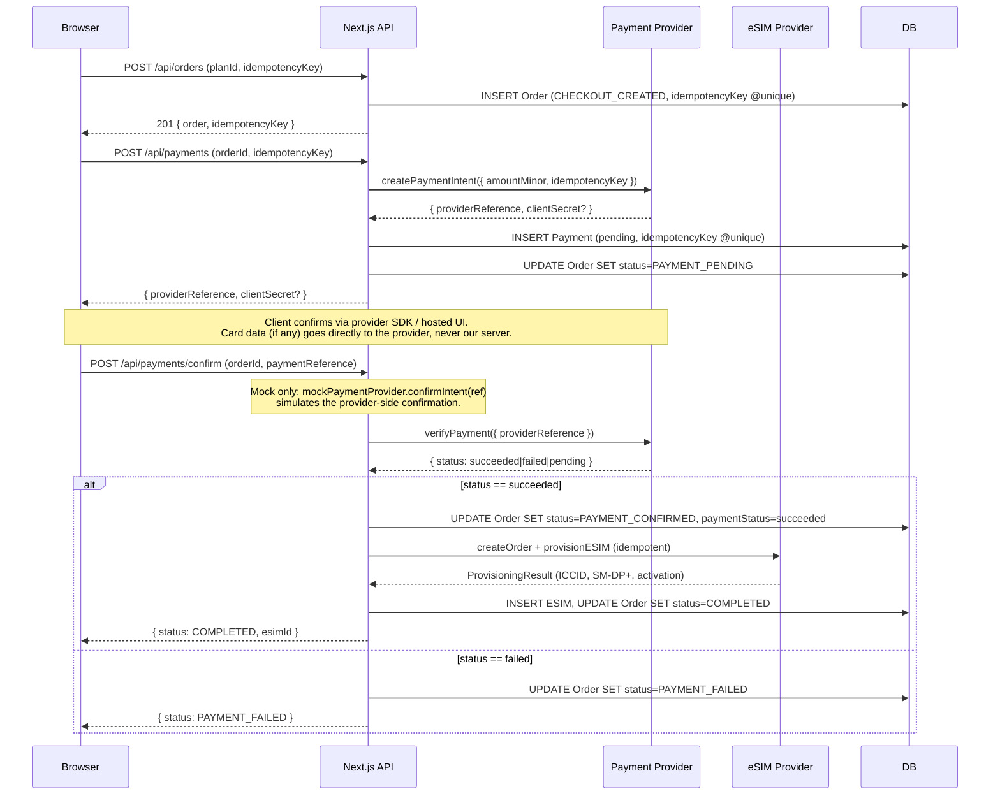
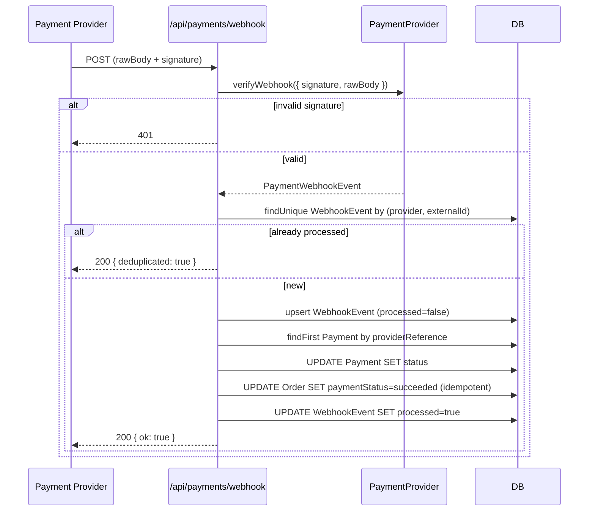

# Payment Integration Guide

This document is the authoritative guide for integrating a real payment
provider (Stripe, Paystack, etc.) into RoamLink. It covers the
`PaymentProvider` interface, the critical server-side verification rule, the
mock provider flow, how to add a real provider, webhook handling, and the
never-store-card-data rule.

> ⚠️ **The shipped `MockPaymentProvider` is the only payment adapter
> implemented.** Real adapters (Stripe, Paystack, etc.) are *documented
> boundaries* — implement them only against the provider's real, documented
> API. Do not fabricate provider integrations.

---

## Table of Contents

1. [The PaymentProvider Interface](#the-paymentprovider-interface)
2. [The Critical Rule: Server-Side Verification](#the-critical-rule-server-side-verification)
3. [MockPaymentProvider Flow](#mockpaymentprovider-flow)
4. [Adding a Real Provider](#adding-a-real-provider)
5. [Webhook Handling and Idempotency](#webhook-handling-and-idempotency)
6. [Never Store Card Data (Rule 10)](#never-store-card-data-rule-10)

---

## The PaymentProvider Interface

The interface lives in
[`src/lib/payments/provider.ts`](../src/lib/payments/provider.ts). The
factory in [`src/lib/payments/index.ts`](../src/lib/payments/index.ts)
selects the concrete provider from `process.env.PAYMENT_PROVIDER`.

```ts
import type { Currency } from "@/lib/money";

export type PaymentIntentResult = {
  providerReference: string;       // the provider's payment intent / charge id
  clientSecret?: string;           // for SDK-based confirmation (e.g. Stripe)
  status: "pending" | "succeeded" | "failed";
  nextAction?: {
    type: "redirect" | "otp" | "none";
    url?: string;
    instructions?: string;
  };
};

export type PaymentVerification = {
  status: "succeeded" | "failed" | "pending";
  providerReference: string;
  raw?: unknown;                   // raw provider response (server-side only)
};

export interface PaymentProvider {
  readonly id: string;
  readonly label: string;
  readonly isMock: boolean;

  /** Create a payment intent for an order. Idempotent via idempotencyKey. */
  createPaymentIntent(input: {
    amountMinor: number;
    currency: Currency;
    description: string;
    idempotencyKey: string;
    metadata?: Record<string, string>;
  }): Promise<PaymentIntentResult>;

  /**
   * Server-side verification of a payment. NEVER trust the client. This calls
   * the provider to confirm the payment actually succeeded.
   */
  verifyPayment(input: {
    providerReference: string;
    idempotencyKey: string;
  }): Promise<PaymentVerification>;

  /** Verify an inbound webhook signature + payload. */
  verifyWebhook(input: {
    signature: string | null;
    rawBody: string;
  }): Promise<PaymentWebhookEvent | null>;
}

export type PaymentWebhookEvent = {
  externalId: string;
  eventType: string;
  data: {
    providerReference?: string;
    status?: "succeeded" | "failed" | "pending";
    amountMinor?: number;
  };
  raw: unknown;
};
```

### Three methods, one invariant

The interface has three methods. Every one of them is a server-side call;
the client never sees `clientSecret` outside of an SDK-based flow that uses
it for direct card confirmation through the provider's own infrastructure
(never our server).

The single invariant they enforce together:

> **The order only advances from `PAYMENT_PENDING` to `PAYMENT_CONFIRMED`
> when `verifyPayment()` returns `succeeded`.** No client claim, no UI
> state, no optimistic update can substitute for that server-side call.

---

## The Critical Rule: Server-Side Verification



### Why this matters

1. **The browser is a hostile environment.** Any client-side code can be
   modified by the user. A "payment succeeded" event in the browser is a
   suggestion, not a fact.
2. **Network retries are real.** The `/api/payments/confirm` route can be
   called multiple times (network blip, double-click). The server must
   verify each time and treat an already-succeeded order as idempotent.
3. **Provider webhook reconciliation.** Even when the client never calls
   `/api/payments/confirm` (e.g. user closes the tab), an inbound payment
   webhook will eventually reconcile the order. See
   [Webhook Handling](#webhook-handling-and-idempotency).

### How the service enforces it

In `confirmAndProvision()` ([`src/lib/orders/service.ts`](../src/lib/orders/service.ts)):

```ts
// --- SERVER-SIDE payment verification (never trust the client) ---
const paymentProvider = getPaymentProvider();
const verification = await paymentProvider.verifyPayment({
  providerReference: order.paymentReference,
  idempotencyKey: input.idempotencyKey,
});

if (verification.status === "failed") {
  // Transition to PAYMENT_FAILED, audit, return.
}
if (verification.status === "pending") {
  // Don't advance; return current state.
}
// verification.status === "succeeded" -> advance to PAYMENT_CONFIRMED + provision.
```

The order's `paymentReference` is what the server stored at
`PAYMENT_PENDING` time. The client passes back the `orderId` and optionally
the `paymentReference` — but the server uses its own stored reference, not
whatever the client sends, for the verification call.

---

## MockPaymentProvider Flow

`MockPaymentProvider` ([`src/lib/payments/mock-provider.ts`](../src/lib/payments/mock-provider.ts))
simulates the entire payment lifecycle in memory. It honors the same
contract as a real provider, so the application exercises the exact same
code paths in dev as it would in production.

### State

```ts
type MockIntent = {
  providerReference: string;
  amountMinor: number;
  currency: Currency;
  status: "pending" | "succeeded" | "failed";
  forceFail: boolean; // test hook
};

const intents = new Map<string, MockIntent>();
const intentByIdem = new Map<string, string>(); // idempotencyKey -> providerReference
```

State is per-process: restarting the dev server resets it. The DB rows
(`Order`, `Payment`) persist, but the in-memory intents don't — so an
in-flight payment attempt can't be resumed after a restart. For repeatable
demos, re-seed.

### `createPaymentIntent()`

```ts
async createPaymentIntent(input): Promise<PaymentIntentResult> {
  // Idempotent: same idempotencyKey returns same providerReference.
  let providerReference = intentByIdem.get(input.idempotencyKey);
  if (!providerReference) {
    providerReference = `mock-pay-${Date.now().toString(36)}-${Math.random().toString(36).slice(2, 8)}`;
    intentByIdem.set(input.idempotencyKey, providerReference);
    const forceFail = input.metadata?.forceFail === "true";
    intents.set(providerReference, { ...status: "pending", forceFail });
  }
  return { providerReference, status: "pending", nextAction: { type: "none", instructions: "Mock payment — confirm on the client to simulate payment." } };
}
```

The `forceFail` metadata flag lets tests force a payment failure by passing
`metadata: { forceFail: "true" }`. This exercises the `PAYMENT_FAILED`
branch of the state machine without a real card-decline simulation.

### `confirmIntent()` — dev-only helper

```ts
/** Dev-only: mark a mock intent as succeeded (simulates client confirmation). */
confirmIntent(providerReference: string): boolean {
  const intent = intents.get(providerReference);
  if (!intent) return false;
  if (intent.forceFail) { intent.status = "failed"; return false; }
  intent.status = "succeeded";
  return true;
}
```

This is **not** part of the `PaymentProvider` interface. It's a mock-only
helper that simulates "the user finished the provider's hosted checkout /
SDK confirmation step". It's called by the `/api/payments/confirm` route
handler before `verifyPayment()`:

```ts
// src/app/api/payments/confirm/route.ts
const provider = getPaymentProvider();
if (provider.isMock && body.paymentReference) {
  mockPaymentProvider.confirmIntent(body.paymentReference);
}
const result = await confirmAndProvision({ orderId, userId, idempotencyKey });
```

A real provider does not need this — the client confirms directly with the
provider via SDK / hosted UI, and `verifyPayment()` reads back the resulting
state.

### `verifyPayment()`

```ts
async verifyPayment(input): Promise<PaymentVerification> {
  const intent = intents.get(input.providerReference);
  if (!intent) return { status: "failed", providerReference: input.providerReference, raw: { reason: "unknown_intent" } };
  if (intent.forceFail) {
    intent.status = "failed";
    return { status: "failed", providerReference: intent.providerReference, raw: { reason: "forced_failure" } };
  }
  return {
    status: intent.status === "pending" ? "pending" : intent.status,
    providerReference: intent.providerReference,
    raw: { amountMinor: intent.amountMinor, currency: intent.currency },
  };
}
```

The mock reads back the truth from its in-memory intent. In production,
this method calls the provider's `GET /payment_intents/{id}` (or
equivalent) — the provider is the source of truth.

### `verifyWebhook()`

Standard HMAC-SHA256 verification against `PAYMENT_WEBHOOK_SECRET`. Same
shape as the real-provider scheme — see
[Webhook Handling](#webhook-handling-and-idempotency).

### Testing the failure path

To exercise `PAYMENT_FAILED`:

1. In checkout, pass `metadata: { forceFail: "true" }` when creating the
   payment intent. (For the MVP UI, this requires modifying the API call —
   there's no UI for it.)
2. Complete checkout normally. `confirmIntent()` will mark the intent
   `failed`, and `verifyPayment()` will return `failed`.
3. The order transitions to `PAYMENT_FAILED`. The UI shows an error message.
4. Retry checkout — the order can transition back to `PAYMENT_PENDING`
   (legal transition per the state machine).

---

## Adding a Real Provider

The factory currently throws for any non-`mock` `PAYMENT_PROVIDER`:

```ts
// src/lib/payments/index.ts
switch (key) {
  case "mock":
    cached = mockPaymentProvider;
    break;
  default:
    throw new Error(
      `Payment provider "${key}" is not implemented. Implement a concrete adapter and register it here. For development, set PAYMENT_PROVIDER=mock.`,
    );
}
```

### Step-by-step: implement a Stripe adapter

This is a structural guide. **Always follow Stripe's actual docs** at
https://stripe.com/docs/api — endpoint paths, request shapes, and signature
schemes are Stripe-specific and may change.

1. **Install the Stripe SDK** (or use `fetch` — both work):
   ```bash
   bun add stripe
   ```

2. **Create the adapter** at `src/lib/payments/stripe-provider.ts`:

   ```ts
   import Stripe from "stripe";
   import type { PaymentProvider, PaymentIntentResult, PaymentVerification, PaymentWebhookEvent } from "./provider";
   import type { Currency } from "@/lib/money";
   import { safeEqual } from "@/lib/security";

   export class StripePaymentProvider implements PaymentProvider {
     readonly id = "stripe";
     readonly label = "Stripe";
     readonly isMock = false;

     private get client(): Stripe {
       const key = process.env.PAYMENT_API_KEY; // sk_live_... or sk_test_...
       if (!key) throw new Error("PAYMENT_API_KEY not set");
       return new Stripe(key, { apiVersion: "2024-06-20" as any });
     }

     async createPaymentIntent(input): Promise<PaymentIntentResult> {
       const intent = await this.client.paymentIntents.create(
         {
           amount: input.amountMinor,
           currency: input.currency.toLowerCase(),
           description: input.description,
           metadata: input.metadata,
           automatic_payment_methods: { enabled: true },
         },
         { idempotencyKey: input.idempotencyKey },
       );
       return {
         providerReference: intent.id,
         clientSecret: intent.client_secret ?? undefined,
         status: intent.status === "succeeded" ? "succeeded" : "pending",
         nextAction: intent.next_action?.redirect_to_url
           ? { type: "redirect", url: intent.next_action.redirect_to_url.url }
           : { type: "none" },
       };
     }

     async verifyPayment(input): Promise<PaymentVerification> {
       const intent = await this.client.paymentIntents.retrieve(input.providerReference);
       const status = intent.status === "succeeded" ? "succeeded"
                    : intent.status === "canceled" ? "failed"
                    : "pending";
       return { status, providerReference: intent.id, raw: intent };
     }

     async verifyWebhook(input): Promise<PaymentWebhookEvent | null> {
       const secret = process.env.PAYMENT_WEBHOOK_SECRET; // Stripe signing secret
       if (!secret) return null;
       // Stripe uses a t=timestamp,v1=hex format. Parse and verify per Stripe docs.
       // ... (Stripe-specific signature verification)
       const event = this.client.webhooks.constructEvent(
         input.rawBody,
         input.signature ?? "",
         secret,
       );
       const pi = event.data.object as Stripe.PaymentIntent;
       return {
         externalId: event.id,
         eventType: event.type,
         data: {
           providerReference: pi.id,
           status: pi.status === "succeeded" ? "succeeded" : "pending",
           amountMinor: pi.amount ?? undefined,
         },
         raw: event,
       };
     }
   }
   ```

3. **Register the adapter** in `src/lib/payments/index.ts`:

   ```ts
   switch (key) {
     case "mock": cached = mockPaymentProvider; break;
     case "stripe": cached = new StripePaymentProvider(); break;
     default: throw new Error(`Unknown PAYMENT_PROVIDER: ${key}`);
   }
   ```

4. **Set env vars**:

   ```ini
   PAYMENT_PROVIDER=stripe
   PAYMENT_API_KEY=sk_live_...           # or sk_test_... for sandbox
   PAYMENT_WEBHOOK_SECRET=whsec_...      # Stripe signing secret
   ```

5. **Update the route handler signature header**: Stripe sends its signature
   in the `Stripe-Signature` header. Update
   [`src/app/api/payments/webhook/route.ts`](../src/app/api/payments/webhook/route.ts)
   to read from that header (or pass `null` to `verifyWebhook` and let the
   adapter re-read the raw body — but the standard pattern is to read all
   signature headers in the route and pass them in).

6. **Register the webhook URL** with Stripe:

   ```
   https://yourdomain.com/api/payments/webhook
   ```

   Listen for `payment_intent.succeeded` and `payment_intent.payment_failed`
   events at minimum.

### Step-by-step: implement a Paystack adapter

Paystack is popular in Africa and aligns well with the MVP's Ghana-first
catalog. Adapt the same pattern:

1. `createPaymentIntent()` → Paystack's `POST /transaction/initialize`.
   Returns an `access_code` and `authorization_url` (hosted checkout).
   `providerReference` = the `reference` you generate client-side or
   server-side.
2. `verifyPayment()` → Paystack's `GET /transaction/verify/{reference}`.
   Read `data.status` (`success` | `failed` | `pending`).
3. `verifyWebhook()` → Paystack sends the signature in the
   `x-paystack-signature` header as a raw HMAC-SHA256 hex of the body with
   your secret key. Verify with `safeEqual()`.

The rest of the flow (route handler, idempotency, state machine) is
unchanged.

---

## Webhook Handling and Idempotency

Payment webhooks are received at `POST /api/payments/webhook`
([`src/app/api/payments/webhook/route.ts`](../src/app/api/payments/webhook/route.ts))
and handled by the same `WebhookEvent`-based idempotency layer as eSIM
webhooks. See [`webhooks.md`](webhooks.md) for the full reference.

### What a payment webhook does

1. **Verify signature** via `paymentProvider.verifyWebhook({ signature, rawBody })`.
   Returns `null` if invalid → respond `401`.
2. **Dedup by `(provider, externalId)`**. If a `WebhookEvent` row already
   exists and is `processed`, respond `{ ok: true, deduplicated: true }`
   without re-applying side effects.
3. **Upsert a `WebhookEvent` row** with `processed: false`.
4. **Reconcile the referenced payment**: find the `Payment` row by
   `providerReference`, update its status, and if `succeeded`, update the
   `Order.paymentStatus` (only if not already `succeeded` — idempotent).
5. **Mark `WebhookEvent.processed: true`**.



### Why we don't provision from the webhook

The webhook route only reconciles `Order.paymentStatus`. It does **not**
kick off provisioning. Provisioning is the responsibility of the
`/api/payments/confirm` flow (or a background retry job that picks up
orders stuck in `PAYMENT_CONFIRMED`).

This separation is deliberate:

- The client's `/api/payments/confirm` call is the primary provisioning
  trigger — it gives the user immediate feedback ("Your eSIM is ready!").
- The webhook is a reconciliation backstop — it ensures the order is marked
  paid even if the client never calls `/api/payments/confirm` (e.g. user
  closes the tab after paying on the provider's hosted checkout).
- A background job (not in MVP scope) should periodically find orders in
  `PAYMENT_CONFIRMED` with no `ESIM` row and call `provisionOrderESIM()`.

### Idempotency guarantee

A provider that retries a webhook (Stripe's at-least-once delivery) will
send the same event multiple times. The `(provider, externalId)` unique
constraint on `WebhookEvent` guarantees only the first delivery applies the
side effect; subsequent deliveries are short-circuited.

---

## Never Store Card Data (Rule 10)

> **Our servers must never see raw card numbers, CVVs, or PINs.** Use the
> payment provider's SDK or hosted checkout for any flow that handles card
> data.

### Why

- **PCI DSS compliance.** Storing card data puts you in PCI DSS Level 1
  scope, which is enormously expensive and operationally heavy. Using the
  provider's hosted checkout or server-side SDK keeps you in the much
  lighter SAQ-A scope.
- **Security.** Card data is a high-value target. Even encrypted storage is
  a liability.
- **Provider support.** Modern providers (Stripe, Paystack) explicitly
  design their flows so card data goes directly to them, never to the
  merchant. Their SDKs tokenize card data in the browser before it ever
  reaches our server.

### How this is enforced in the MVP

- `MockPaymentProvider` never asks for card data. The mock "payment" is a
  button click that calls `confirmIntent()`.
- The `PaymentProvider` interface has no method that accepts card data.
  `createPaymentIntent` takes amount/currency/description/metadata only.
- The `/api/payments/confirm` route takes only `orderId` and
  `paymentReference` — never card data.

### What a real integration looks like

- **Stripe**: use Stripe.js / Stripe Elements in the browser to collect
  card data and tokenize it. The browser sends the token to Stripe
  directly, then sends the resulting `paymentIntent.id` to our server.
  `verifyPayment()` calls Stripe's API to confirm.
- **Paystack**: redirect the user to Paystack's hosted checkout. Paystack
  redirects back with a `reference` query param. The browser sends that
  reference to our server; `verifyPayment()` calls Paystack's verify
  endpoint.
- **Never**: a `<form>` posting card number + CVV to our server.

### What about saved cards / recurring billing?

Out of scope for the MVP. When added:

- Use the provider's "setup intent" + "payment method" APIs (Stripe) or
  "authorization" APIs (Paystack).
- Store only the provider's opaque token (e.g. `pm_...` for Stripe,
  `authorization_code` for Paystack) — never the card number.
- The customer-facing UI should show "Visa ending in 4242" (last 4 only,
  which the provider returns) — not the full PAN.
