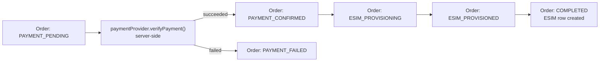
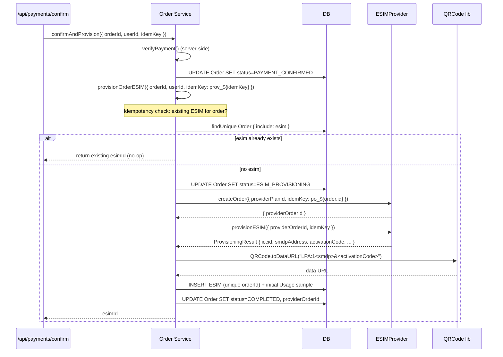

# Provisioning Flow

This document describes how an eSIM is provisioned after a payment is
confirmed. The provisioning flow is the second half of the purchase journey
— it takes a paid order and produces a ready-to-install eSIM with ICCID,
SM-DP+ address, activation code, and a QR code.

Provisioning is implemented in
[`src/lib/orders/service.ts`](../src/lib/orders/service.ts), primarily in
`confirmAndProvision()` and `provisionOrderESIM()`.

---

## Table of Contents

1. [When Provisioning Triggers](#when-provisioning-triggers)
2. [The Provisioning Sequence](#the-provisioning-sequence)
3. [Idempotency at Every Step](#idempotency-at-every-step)
4. [One eSIM per Order](#one-esim-per-order)
5. [QR Code Generation](#qr-code-generation)
6. [Failure Handling](#failure-handling)
7. [Never Expose Provider Credentials to the Browser](#never-expose-provider-credentials-to-the-browser)

---

## When Provisioning Triggers

Provisioning is triggered by `confirmAndProvision()` after the
**server-side** payment verification returns `succeeded`.



The trigger points:

1. **Primary: `/api/payments/confirm`** — the client calls this after the
   user completes the provider's hosted checkout / SDK confirmation. The
   server verifies, advances the order to `PAYMENT_CONFIRMED`, then
   immediately calls `provisionOrderESIM()` synchronously. The HTTP response
   includes `esimId`, and the client redirects to the eSIM details page.

2. **Recovery: `retryProvisioning(orderId)`** — for orders that landed in
   `PROVISIONING_FAILED`. Re-enters `provisionOrderESIM()` with a fresh
   idempotency key.

3. **(Future) Background job** — picks up orders in `PAYMENT_CONFIRMED`
   with no `ESIM` row (e.g. the original provisioning crashed mid-flight
   before the DB write). Not in MVP scope but the architecture supports it:
   `provisionOrderESIM()` is safe to call repeatedly.

Provisioning is **never** triggered directly by the client. The client only
ever asks "did this payment succeed?" via `/api/payments/confirm`. Everything
else is the server's responsibility.

---

## The Provisioning Sequence

Inside `provisionOrderESIM()` (in
[`src/lib/orders/service.ts`](../src/lib/orders/service.ts)):



### Step 1: Idempotency check

```ts
const order = await db.order.findUnique({ where: { id: input.orderId }, include: { plan: true, esim: true } });
if (order.esim) {
  // Rule 3: an order can only provision once.
  logger.info("provision.idempotent_skip", { orderId: order.id, esimId: order.esim.id });
  return order.esim.id;
}
```

If the order already has an eSIM (because a previous provisioning succeeded
but the response was lost), we return the existing `esimId` immediately. No
duplicate provisioning, no duplicate charge to the upstream provider.

### Step 2: State-machine transition

```ts
if (order.status === "PROVISIONING_FAILED" || order.status === "PAYMENT_CONFIRMED") {
  assertTransition(order.status as OrderStatus, "ESIM_PROVISIONING");
} else if (order.status !== "ESIM_PROVISIONING") {
  throw new AppError("conflict", `Cannot provision from ${order.status}`, 409, "This order is not ready for provisioning.");
}

await db.order.update({ where: { id: order.id }, data: { status: "ESIM_PROVISIONING" } });
```

`assertTransition()` validates that the current state can legally move to
`ESIM_PROVISIONING`. Legal source states are `PAYMENT_CONFIRMED`,
`PROVISIONING_FAILED`, and `ESIM_PROVISIONING` (a previous attempt that
crashed mid-flight).

### Step 3: Create provider order (idempotent)

```ts
const provider = getESIMProvider();
const orderKey = `po_${order.id}`;
const { providerOrderId } = await provider.createOrder({
  providerPlanId: order.plan.providerPlanId,
  idempotencyKey: orderKey,
});
```

The idempotency key `po_${order.id}` is derived from the order id — so a
retry of provisioning for the same order hits the same provider-side order
record. The provider returns the same `providerOrderId` on retry.

We pass `order.plan.providerPlanId` (the provider's native plan id, stored
on the `Plan` row at sync time) — not our internal `Plan.id`.

### Step 4: Provision the eSIM (idempotent)

```ts
const result: ProvisioningResult = await provider.provisionESIM({
  providerOrderId,
  idempotencyKey: input.idempotencyKey,
});
```

`input.idempotencyKey` here is `prov_${client_idem_key}` (derived in
`confirmAndProvision()`). For retries via `retryProvisioning()`, it's
`prov_retry_${order.id}_${Date.now()}` — a fresh key per retry attempt,
which means a fresh provisioning call to the provider. **This is
intentional**: if the previous provisioning failed (provider returned an
error), we want a fresh attempt. If the previous provisioning succeeded but
we crashed before the DB write, the provider's idempotency map might have
evicted the entry — but the `ESIM.orderId @unique` constraint still
protects us (the INSERT below would fail, and we'd catch and fall through
to fetch the existing eSIM via `getESIM()`).

> ⚠️ **Adapter contract reminder**: `provisionESIM()` must be idempotent per
> idempotency key. A real adapter should also handle the case where the
> provider's idempotency window has expired by querying for an existing eSIM
> on the order before creating a new one.

### Step 5: Generate the QR code

```ts
const qrPayload = `LPA:1${result.smdpAddress}&${result.activationCode}`;
const qrCode = await QRCode.toDataURL(qrPayload, { margin: 2, width: 480 });
```

The QR encodes an **LPA** (Local Profile Assistant) string in the standard
format `LPA:1<smdpAddress>&<activationCode>`. Scanning this QR with a
phone's camera (or entering the SM-DP+ address and activation code manually
in the phone's eSIM settings) triggers the eSIM download from the
provider's SM-DP+ server.

See [QR Code Generation](#qr-code-generation) below.

### Step 6: Persist the eSIM (1:1 with order)

```ts
const esim = await db.esim.create({
  data: {
    userId: order.userId,
    orderId: order.id,                  // unique constraint enforces 1:1
    provider: provider.id,
    providerESIMId: result.providerESIMId,
    iccid: result.iccid,
    smdpAddress: result.smdpAddress,
    activationCode: result.activationCode,
    matchId: result.matchId ?? null,
    qrCode,
    status: "active",
    dataAmount: result.dataAmountMB,
    dataRemaining: result.dataAmountMB, // starts full
    validityDays: result.validityDays,
    expiresAt: new Date(result.expiresAt),
  },
});
```

If two concurrent provisioning attempts race to insert an `ESIM` for the
same order, the `ESIM.orderId @unique` constraint causes one of them to
throw a Prisma unique-constraint error. The service layer should catch this
and fall through to fetch the existing eSIM (the MVP relies on the
idempotency-key check at the top to prevent this race in practice).

### Step 7: Mark the order COMPLETED + record initial usage sample

```ts
await db.order.update({
  where: { id: order.id },
  data: { status: "COMPLETED", providerOrderId, esim: { connect: { id: esim.id } } },
});

await db.usage.create({
  data: { esimId: esim.id, dataUsed: 0, dataRemaining: result.dataAmountMB, source: "provider" },
});
```

The initial usage sample (0 used, full remaining) is recorded so the usage
chart on the eSIM details page has a starting point.

### Step 8: Audit + return

```ts
await audit({ userId: input.userId, orderId: order.id, action: "esim.provisioned", entity: "esim", entityId: esim.id, ip: input.ip });
logger.info("esim.provisioned", { orderId: order.id, esimId: esim.id, iccid: result.iccid });
return esim.id;
```

`confirmAndProvision()` then returns `{ status: "COMPLETED", paymentStatus: "succeeded", esimId }`
to the route handler, which triggers the `payment.successful` and
`esim.provisioned` notifications.

---

## Idempotency at Every Step

| Step                          | Idempotency mechanism                                                    |
| ----------------------------- | ------------------------------------------------------------------------ |
| 1. Existing eSIM check        | `Order.include: esim` — if present, short-circuit.                       |
| 2. State-machine transition   | `assertTransition()` rejects illegal retries (e.g. from `COMPLETED`).    |
| 3. `createOrder()`            | Provider-side idempotency key `po_${order.id}`; provider returns same `providerOrderId`. |
| 4. `provisionESIM()`          | Provider-side idempotency key `prov_${idemKey}`; provider returns same `ProvisioningResult`. |
| 5. QR generation              | Deterministic from SM-DP+ + activation code — no side effects.           |
| 6. `INSERT ESIM`              | `ESIM.orderId @unique` DB constraint — race-safe.                        |
| 7. `UPDATE Order COMPLETED`   | Idempotent update — setting `status=COMPLETED` twice is a no-op.         |
| 8. Audit + notification       | `Notification` rows are append-only logs; duplicates are harmless. Audit logs are append-only. |

If the entire flow crashes between step 4 (provider provisioned) and step 6
(DB insert), the next call to `provisionOrderESIM()` will:

- Pass step 1 (no `esim` yet).
- Pass step 2 (`ESIM_PROVISIONING` → `ESIM_PROVISIONING` is a no-op
  transition, or `PAYMENT_CONFIRMED` → `ESIM_PROVISIONING` if we crashed
  before the update).
- Re-call `createOrder()` with the same `po_${order.id}` key — provider
  returns the same `providerOrderId`.
- Re-call `provisionESIM()` with the same `prov_${idemKey}` key — provider
  returns the same `ProvisioningResult` (same ICCID, same SM-DP+, same
  activation code).
- Generate the same QR.
- Insert the `ESIM` row.

If the provider's idempotency window has expired and it provisions a *new*
eSIM (new ICCID, new SM-DP+), we'd end up with two eSIMs for one charge.
**This is the main risk of idempotency-window expiry.** A production-grade
adapter should:

- Persist the idempotency key → result mapping in a DB table.
- Before calling `provisionESIM()` on a retry, check the DB for an existing
  result.
- If the DB has no record but the provider's idempotency check returns a
  "duplicate" response, fetch the existing eSIM via `getESIM()` instead of
  provisioning a new one.

The mock provider doesn't have this problem — its in-memory maps persist for
the process lifetime.

---

## One eSIM per Order

> **Business rule 3: an order can only provision once.**

This is enforced at multiple layers:

1. **DB schema**: `ESIM.orderId` is `@unique` (1:1 relationship).
2. **Service layer**: `provisionOrderESIM()` checks `order.esim` first and
   short-circuits if present.
3. **State machine**: `COMPLETED` only transitions to `REFUNDED`, so a
   completed order can never re-enter provisioning.

### Why

- **Cost control.** Each provisioning call may incur a wholesale charge
  from the upstream provider. Allowing multiple eSIMs per order would
  multiply our cost without multiplying revenue.
- **Customer clarity.** One purchase = one eSIM. The user knows what they
  bought.
- **Audit simplicity.** One order, one payment, one eSIM — the audit trail
  is linear.

### What if the customer wants more data?

They buy a **top-up** for the existing eSIM (`/dashboard/esims/[id]/top-up`),
not a new order. Top-ups add data to the existing eSIM via the provider's
`topUp()` method, recorded in the `TopUp` table.

### What if the customer wants a second eSIM?

They place a second order. Each order is independent and provisions its own
eSIM.

---

## QR Code Generation

The QR code is generated in `provisionOrderESIM()` immediately after
provisioning:

```ts
const qrPayload = `LPA:1${result.smdpAddress}&${result.activationCode}`;
const qrCode = await QRCode.toDataURL(qrPayload, { margin: 2, width: 480 });
```

### LPA format

The standard eSIM installation QR encodes an LPA (Local Profile Assistant)
string:

```
LPA:1<smdpAddress>&<activationCode>
```

- `LPA:1$` is the activation prefix.
- `<smdpAddress>` is the SM-DP+ (Subscription Manager - Data Preparation
  Plus) server that holds the eSIM profile.
- `<activationCode>` is the matching key that tells the SM-DP+ which
  profile to deliver.

Scanning the QR with a phone's camera (iOS / Android) opens the eSIM
installation flow automatically.

### Manual installation

The eSIM details page (`/dashboard/esims/[id]`) also shows the SM-DP+
address, activation code, and match ID as copyable fields. Users can enter
these manually in their phone's eSIM settings (Settings → Cellular → Add
eSIM → "Use QR code" or "Enter details manually").

### Storage as data URL

The QR is stored in `ESIM.qrCode` as a `data:` URL (base64-encoded PNG).
This avoids a separate `/api/esims/[id]/qr` route and makes the QR
 SSR-friendly (just an ``).

### Real provider note

Some real providers return a ready-made QR image URL (HTTP URL) instead of
SM-DP+ + activation code fields. In that case, store the provider's URL in
`ESIM.qrCode` directly. The UI doesn't care whether `qrCode` is a data URL
or an HTTP URL — it just renders it as an image src. If the provider
returns SM-DP+ + activation code but no QR URL, generate the LPA string and
QR locally as the MVP does.

---

## Failure Handling

### Payment verification fails

In `confirmAndProvision()`:

```ts
if (verification.status === "failed") {
  await db.order.update({
    where: { id: order.id },
    data: { status: "PAYMENT_FAILED", paymentStatus: "failed", failureReason: "Payment verification failed" },
  });
  await db.payment.updateMany({ where: { orderId: order.id, providerReference: order.paymentReference }, data: { status: "failed" } });
  await audit({ ... action: "payment.failed" });
  return { status: "PAYMENT_FAILED", paymentStatus: "failed", esimId: null };
}
```

The order is recoverable: `PAYMENT_FAILED → PAYMENT_PENDING` is a legal
transition (retry payment). No eSIM is provisioned; no charge is recorded
as succeeded.

### Provisioning fails

```ts
try {
  const esimId = await provisionOrderESIM({ ... });
  return { status: "COMPLETED", paymentStatus: "succeeded", esimId };
} catch (err) {
  logger.error("provisioning.failed", { orderId: order.id, error: err.message });
  await db.order.update({
    where: { id: order.id },
    data: { status: "PROVISIONING_FAILED", failureReason: err.message },
  });
  await audit({ ... action: "provisioning.failed" });
  throw classifyProviderError("activating your eSIM", err);
}
```

The order is **also** recoverable: `PROVISIONING_FAILED →
ESIM_PROVISIONING` is legal (retry provisioning). Crucially, the payment is
**already succeeded** — we don't re-charge the customer on retry.

### Retry provisioning

`retryProvisioning(orderId, userId, ip)` re-enters `provisionOrderESIM()`
with a fresh idempotency key. It's exposed via the order details page (UI)
and can be triggered by an admin.

```ts
export async function retryProvisioning(orderId: string, userId: string, ip?: string) {
  const order = await db.order.findUnique({ where: { id: orderId }, include: { esim: true } });
  if (!order || order.userId !== userId) throw new AppError("not_found", "Order not found", 404, "Order not found.");
  if (order.esim) return { status: "COMPLETED", esimId: order.esim.id }; // already done
  if (order.paymentStatus !== "succeeded") throw new AppError("conflict", "Payment not confirmed", 409, "Payment must be confirmed before retrying.");
  const esimId = await provisionOrderESIM({ orderId, userId, idempotencyKey: `prov_retry_${order.id}_${Date.now()}`, ip });
  return { status: "COMPLETED", esimId };
}
```

### Refund path

If provisioning repeatedly fails and the customer wants their money back,
the order can transition `PROVISIONING_FAILED → REFUNDED`. The refund
itself is issued via the payment provider (not implemented in the MVP —
would be a `paymentProvider.refund()` method on the interface). The state
machine allows it.

---

## Never Expose Provider Credentials to the Browser

Several pieces of data must never reach the browser:

| Data                                | Where it lives                              | Browser-visible? |
| ----------------------------------- | ------------------------------------------- | ---------------- |
| `ESIM_API_KEY` / `ESIM_API_SECRET`  | Server-only env vars                        | No               |
| `ESIM_WEBHOOK_SECRET`               | Server-only env var                         | No               |
| Provider-native plan payloads       | `Plan.metadata` (server-side JSON string)   | No               |
| Provider-native eSIM payloads       | Not stored (only normalized fields)         | No               |
| `Payment.raw` (provider response)   | `Payment.raw` (server-side JSON string)     | No               |
| `Payment.idempotencyKey`            | DB column, never serialized to client       | No               |
| `WebhookEvent.payload`              | DB column, admin-only                       | No               |
| Wholesale prices                    | `Plan.wholesalePrice` — stripped by `toPublicPlan()` | No    |
| `Order.planSnapshot`                | Stored server-side; not returned by `/api/orders/[id]` | No |

### What IS browser-visible

The eSIM details page (`/dashboard/esims/[id]`) needs to show the user
their ICCID, SM-DP+ address, activation code, match ID, and QR code so they
can install the eSIM. These are **eSIM installation credentials**, not
provider API credentials — they're the user's own data, scoped to their
eSIM, and required for the user to actually use what they bought.

The route handler for `GET /api/esims/[id]` checks that the eSIM belongs to
the requesting user (`esim.userId === user.id`) before returning these
fields. Admins can see all eSIMs via `/api/admin/esims`.

### How the API prevents leakage

- `/api/plans` and `/api/plans/[id]` use `toPublicPlan()` which omits
  `wholesalePrice`, `providerPlanId`, `metadata`, and `pricingRule`.
- `/api/orders` and `/api/orders/[id]` return `OrderSnapshot` which
  includes plan name / country / data / validity but not the full
  `planSnapshot` JSON.
- `/api/esims/[id]` returns the eSIM's installation fields (ICCID, SM-DP+,
  activation code, match ID, QR code) but not the provider's API key or
  raw webhook payloads.
- `/api/admin/*` routes are gated by `requireAdmin()` and intended for
  internal use only.

If you add a new API route, audit what you return. The general rule:
**provider internals (API keys, raw payloads, wholesale prices, webhook
secrets) stay server-side; user-owned data (their eSIM, their orders) goes
to the browser scoped to that user.**
