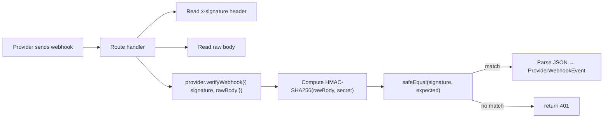

# Webhooks

This document describes the webhook infrastructure that handles asynchronous
events from eSIM and payment providers. Webhooks are the source of truth
for provider-side state changes that happen outside our request/response
cycle: usage updates, eSIM status changes, payment reconciliations,
expirations.

---

## Table of Contents

1. [Endpoints](#endpoints)
2. [Signature Verification](#signature-verification)
3. [Idempotency via WebhookEvent](#idempotency-via-webhookevent)
4. [Event Logging](#event-logging)
5. [eSIM Provider Webhook](#esim-provider-webhook)
6. [Payment Provider Webhook](#payment-provider-webhook)
7. [Mock Provider Webhooks and Testing](#mock-provider-webhooks-and-testing)

---

## Endpoints

| Endpoint                          | Source            | Handler                                                                  |
| --------------------------------- | ----------------- | ------------------------------------------------------------------------ |
| `POST /api/webhooks/esim`         | eSIM provider     | [`src/app/api/webhooks/esim/route.ts`](../src/app/api/webhooks/esim/route.ts)     |
| `POST /api/payments/webhook`      | Payment provider  | [`src/app/api/payments/webhook/route.ts`](../src/app/api/payments/webhook/route.ts) |

Both endpoints are **public** (no auth cookie required) — they authenticate
via HMAC signature verification instead. They must be reachable from the
public internet so providers can deliver events to them.

### Local development

In local dev, providers (mock or real) can't reach `localhost:3000`
directly. Options:

- **For mock testing**: send webhooks manually with `curl` (see
  [Mock Provider Webhooks and Testing](#mock-provider-webhooks-and-testing)).
- **For real-provider testing**: use a tunnel like
  [ngrok](https://ngrok.com) or [Cloudflare TryCloudflare](https://try.cloudflare.com)
  to expose `localhost:3000` to the internet, then register the tunnel URL
  with the provider.
- **For staging**: deploy to a public staging environment and register the
  staging URL with the provider.

---

## Signature Verification

Every webhook is verified via **HMAC-SHA256** of the raw request body with a
shared secret. Mismatched signatures return `401 Unauthorized` — the
request is rejected before any business logic runs.

### How it works



The signature is read from the `x-signature` header (or
`x-webhook-signature` as a fallback). The raw body is read with
`await req.text()` (not `req.json()`) — this preserves the exact bytes the
provider signed.

The adapter's `verifyWebhook()` method:

1. Looks up the shared secret from the appropriate env var
   (`ESIM_WEBHOOK_SECRET` or `PAYMENT_WEBHOOK_SECRET`).
2. Computes `HMAC-SHA256(rawBody, secret)` and hex-encodes it.
3. Compares the computed signature to the provided signature using
   `safeEqual()` (constant-time comparison from
   [`src/lib/security.ts`](../src/lib/security.ts)) — never `===`, which is
   vulnerable to timing attacks.
4. If valid, JSON-parses the body and returns a normalized
   `ProviderWebhookEvent` (or `PaymentWebhookEvent`).
5. If invalid (bad signature, unparseable JSON, missing secret), returns
   `null`.

The route handler:

```ts
const event = await provider.verifyWebhook({ signature, rawBody });
if (!event) {
  logger.warn("esim.webhook.invalid_signature");
  return json({ error: "invalid signature" }, 401);
}
```

### Why constant-time comparison?

`===` returns as soon as it finds a mismatched byte. An attacker can
measure response time to determine the correct signature byte-by-byte (a
timing attack). `safeEqual()` always takes the same amount of time
regardless of where the mismatch is, defeating the attack.

### Provider-specific signature schemes

The shipped `RealESIMProvider.verifyWebhook()` and
`MockPaymentProvider.verifyWebhook()` both use the simple
`HMAC-SHA256(rawBody, secret)` → hex scheme. Real providers may use
different schemes:

- **Stripe**: `Stripe-Signature` header in `t=timestamp,v1=hex` format. The
  signature is `HMAC-SHA256(t + "." + rawBody, secret)`. Verify by
  reconstructing and comparing; reject if the timestamp is too old (e.g.
  > 5 minutes).
- **Paystack**: `x-paystack-signature` header, raw HMAC-SHA512 hex of the
  body with the secret key.
- **Airalo**: check their docs; commonly an `X-Airalo-Signature` header
  with HMAC-SHA256.

When integrating a real provider, replace the `verifyWebhook()` method in
the adapter to match the provider's scheme. The route handler doesn't need
to change — it always calls `provider.verifyWebhook({ signature, rawBody })`.

---

## Idempotency via WebhookEvent

Providers deliver webhooks **at least once**. Duplicates are common —
especially under network partitions or slow responses. Our infrastructure
must apply each webhook's side effect exactly once.

### The mechanism

Every webhook is recorded in the `WebhookEvent` table, uniquely keyed by
`(provider, externalId)`:

```prisma
model WebhookEvent {
  id          String   @id @default(cuid())
  provider    String
  eventType   String
  externalId  String?  // provider's event id, used for dedup
  payload     String   // JSON string
  processed   Boolean  @default(false)
  error       String?
  createdAt   DateTime @default(now())
  processedAt DateTime?

  @@unique([provider, externalId])
  @@index([provider, eventType])
}
```

The route handler:

```ts
// Idempotency dedup.
const existing = await db.webhookEvent.findUnique({
  where: { provider_externalId: { provider: provider.id, externalId: event.externalId } },
});
if (existing?.processed) {
  return json({ ok: true, deduplicated: true });
}

const log = await db.webhookEvent.upsert({
  where: { provider_externalId: { provider: provider.id, externalId: event.externalId } },
  create: { provider: provider.id, eventType: event.eventType, externalId: event.externalId, payload: rawBody, processed: false },
  update: {},
});

// ... apply side effects ...

await db.webhookEvent.update({ where: { id: log.id }, data: { processed: true, processedAt: new Date() } });
```

### Race safety

Two concurrent deliveries of the same webhook race to insert the
`WebhookEvent` row. The `@@unique([provider, externalId])` constraint
guarantees only one insert succeeds; the other throws a Prisma
unique-constraint error. The `upsert` handles this: the losing transaction
falls through to `update: {}` (a no-op), getting back the row the winner
created.

A more rigorous implementation would wrap the entire "insert + apply +
mark processed" in a transaction with row-level locking. The MVP relies on
the unique constraint + the `processed` flag check to make concurrent
duplicates safe enough; full transactional correctness is a future
hardening step.

### What if `externalId` is missing?

Some providers don't include an event id. In that case, the adapter
generates a synthetic one (e.g. `evt-${Date.now()}`), but this breaks
dedup — every delivery looks new. **Always prefer providers that include
a stable externalId.** For providers that don't, hash the payload body
to synthesize a stable id:

```ts
externalId: parsed.id ?? crypto.createHash("sha256").update(rawBody).digest("hex").slice(0, 32)
```

---

## Event Logging

Every webhook — successful, deduplicated, or invalid — is logged via the
structured logger (`src/lib/logger.ts`):

| Event                              | Level | When                                          |
| ---------------------------------- | ----- | --------------------------------------------- |
| `esim.webhook.invalid_signature`   | warn  | Signature verification failed.                |
| `esim.webhook.applied`             | info  | Side effect applied to an eSIM.               |
| `payment.webhook.invalid_signature`| warn  | Signature verification failed.                |
| `payment.webhook.reconciled`       | info  | Payment status reconciled with provider.      |

The `WebhookEvent` row also persists the raw payload (the `payload` JSON
string column), the `eventType`, the `processed` flag, and the `processedAt`
timestamp. This gives a full audit trail of every webhook received.

### Inspecting webhook history

Admins can query the `WebhookEvent` table directly (no admin UI in the
MVP — would be a future addition):

```sql
SELECT provider, eventType, externalId, processed, createdAt, processedAt
FROM WebhookEvent
ORDER BY createdAt DESC
LIMIT 50;
```

---

## eSIM Provider Webhook

The eSIM provider webhook (`POST /api/webhooks/esim`) handles events
related to eSIM lifecycle: usage updates, status changes, expirations.

### Supported event types (normalized)

The route handler dispatches on the parsed `event.data` fields rather than
the `eventType` string, so it works with any provider's event taxonomy:

- **`dataRemainingMB` updated**: writes a new `Usage` sample (with
  `dataUsed = max(0, esim.dataAmount - dataRemainingMB)`) and updates
  `ESIM.dataRemaining`. If `dataRemainingMB <= 0`, sets `ESIM.status =
  "exhausted"`.
- **`status` changed**: updates `ESIM.status`.
- **`expiresAt` updated**: updates `ESIM.expiresAt`.

### Code

```ts
if (event.data.providerESIMId) {
  const esim = await db.esim.findFirst({ where: { providerESIMId: event.data.providerESIMId } });
  if (esim) {
    const update: Record<string, unknown> = {};
    if (event.data.dataRemainingMB != null) {
      update.dataRemaining = event.data.dataRemainingMB;
      if (event.data.dataRemainingMB <= 0) update.status = "exhausted";
    }
    if (event.data.status) update.status = event.data.status;
    if (event.data.expiresAt) update.expiresAt = new Date(event.data.expiresAt);
    if (Object.keys(update).length > 0) {
      await db.esim.update({ where: { id: esim.id }, data: update });
      if (event.data.dataRemainingMB != null) {
        await db.usage.create({
          data: {
            esimId: esim.id,
            dataUsed: Math.max(0, esim.dataAmount - event.data.dataRemainingMB),
            dataRemaining: event.data.dataRemainingMB,
            source: "provider",
          },
        });
      }
    }
    logger.info("esim.webhook.applied", { esimId: esim.id, eventType: event.eventType });
  }
}
```

### What if the eSIM isn't found?

If the webhook references a `providerESIMId` that doesn't match any
`ESIM.providerESIMId` in our DB, the webhook is logged (via the
`WebhookEvent` row) but no side effect is applied. This can happen if:

- The webhook arrives before our DB write completed (race). The next
  webhook for the same eSIM will succeed.
- The eSIM was provisioned by another instance / system. Investigate.
- The provider is sending events for an eSIM that was cancelled / refunded
  out-of-band. Investigate.

The webhook is still marked `processed: true` because we've handled it
(we decided to take no action). Re-deliveries will be deduplicated.

---

## Payment Provider Webhook

The payment provider webhook (`POST /api/payments/webhook`) reconciles
payment status for orders. It's the backstop for cases where the client
never calls `/api/payments/confirm` (e.g. user closes the tab after paying
on the provider's hosted checkout).

### What it does

1. Verifies signature.
2. Dedup via `WebhookEvent`.
3. Finds the `Payment` row by `providerReference` (from
   `event.data.providerReference`).
4. Updates `Payment.status`.
5. If `succeeded`, updates `Order.paymentStatus = "succeeded"` (idempotent —
   only if not already `succeeded`).

### What it does NOT do

It does **not** advance the order to `PAYMENT_CONFIRMED`, and it does
**not** trigger provisioning. Those are the responsibility of the
`/api/payments/confirm` flow or a background retry job.

This separation is deliberate:

- The client's `/api/payments/confirm` call is the primary provisioning
  trigger — it gives the user immediate feedback.
- The webhook is a reconciliation backstop — it ensures the order is marked
  paid even if the client never returns.
- A background job (not in MVP scope) should pick up orders in
  `PAYMENT_CONFIRMED` with no `ESIM` row and call `provisionOrderESIM()`.

### Code

```ts
if (event.data.providerReference) {
  const payment = await db.payment.findFirst({ where: { providerReference: event.data.providerReference } });
  if (payment) {
    const status = event.data.status ?? "succeeded";
    await db.payment.update({ where: { id: payment.id }, data: { status } });
    if (status === "succeeded") {
      // Order state machine update; provisioning handled by confirm flow / retry job.
      await db.order.updateMany({
        where: { id: payment.orderId, paymentStatus: { not: "succeeded" } },
        data: { paymentStatus: "succeeded" },
      });
      logger.info("payment.webhook.reconciled", { orderId: payment.orderId, status });
    }
  }
}
```

The `updateMany` with `where: { paymentStatus: { not: "succeeded" } }` is
idempotent: if the order is already marked succeeded, no update happens
(zero rows affected), and the webhook still returns `{ ok: true }`.

---

## Mock Provider Webhooks and Testing

The mock eSIM and payment providers verify webhook signatures exactly as a
real provider would — using HMAC-SHA256 with the shared secret. This means
you can fully test the signature verification path in dev.

### Setup

Set `ESIM_WEBHOOK_SECRET` and `PAYMENT_WEBHOOK_SECRET` in `.env`:

```ini
ESIM_WEBHOOK_SECRET=dev-esim-webhook-secret
PAYMENT_WEBHOOK_SECRET=dev-payment-webhook-secret
```

Restart the dev server.

### Test the eSIM webhook

Simulate a usage update for a provisioned eSIM:

```bash
# Find a provisioned eSIM's providerESIMId (from the admin UI or DB)
PROVIDER_ESIM_ID="mock-esim-xxxxx"

# Build the payload
BODY=$(cat <<EOF
{
  "id": "evt-test-1",
  "type": "usage.update",
  "esimId": "$PROVIDER_ESIM_ID",
  "dataRemainingMB": 5120
}
EOF
)

# Compute the HMAC-SHA256 signature
SIG=$(printf '%s' "$BODY" | openssl dgst -sha256 -hmac "$ESIM_WEBHOOK_SECRET" | sed 's/^.* //')

# Send the webhook
curl -X POST http://localhost:3000/api/webhooks/esim \
  -H "Content-Type: application/json" \
  -H "x-signature: $SIG" \
  -d "$BODY"
# → { "ok": true }
```

Replay it to test idempotency:

```bash
curl -X POST http://localhost:3000/api/webhooks/esim \
  -H "Content-Type: application/json" \
  -H "x-signature: $SIG" \
  -d "$BODY"
# → { "ok": true, "deduplicated": true }
```

Send one with a bad signature to test the 401 path:

```bash
curl -X POST http://localhost:3000/api/webhooks/esim \
  -H "Content-Type: application/json" \
  -H "x-signature: deadbeef" \
  -d "$BODY"
# → 401 { "error": "invalid signature" }
```

### Test the payment webhook

Simulate a `payment_intent.succeeded` reconciliation:

```bash
# Find a Payment's providerReference (from the DB)
PROVIDER_REF="mock-pay-xxxxx"

BODY=$(cat <<EOF
{
  "id": "evt-pay-test-1",
  "type": "payment.succeeded",
  "providerReference": "$PROVIDER_REF",
  "status": "succeeded",
  "amountMinor": 945
}
EOF
)

SIG=$(printf '%s' "$BODY" | openssl dgst -sha256 -hmac "$PAYMENT_WEBHOOK_SECRET" | sed 's/^.* //')

curl -X POST http://localhost:3000/api/payments/webhook \
  -H "Content-Type: application/json" \
  -H "x-signature: $SIG" \
  -d "$BODY"
# → { "ok": true }
```

### How to compute the signature in JavaScript / TypeScript

For your own scripts or integration tests:

```ts
import { createHmac } from "crypto";

function sign(rawBody: string, secret: string): string {
  return createHmac("sha256", secret).update(rawBody).digest("hex");
}

const body = JSON.stringify({ id: "evt-1", type: "usage.update", esimId: "...", dataRemainingMB: 5120 });
const sig = sign(body, process.env.ESIM_WEBHOOK_SECRET!);

await fetch("http://localhost:3000/api/webhooks/esim", {
  method: "POST",
  headers: { "Content-Type": "application/json", "x-signature": sig },
  body,
});
```

### Notes on mock webhook behavior

- The mock providers' `verifyWebhook()` will return `null` if
  `ESIM_WEBHOOK_SECRET` / `PAYMENT_WEBHOOK_SECRET` is not set. Set them in
  `.env` to enable webhook testing.
- The mock eSIM provider's `verifyWebhook()` tolerates a missing signature
  in dev mode (returns the parsed event without verifying). This is
  intentional for quick `curl` testing without signing — but it should NOT
  be relied upon. Always set the secret and sign your test requests.
- The mock payment provider strictly requires a valid signature (returns
  `null` if `PAYMENT_WEBHOOK_SECRET` is unset or the signature doesn't
  match).

---

## See Also

- [`architecture.md`](architecture.md) — high-level architecture and provider
  abstraction boundaries
- [`esim-provider.md`](esim-provider.md) — `verifyWebhook()` contract and
  real-provider integration
- [`payments.md`](payments.md) — payment webhook reconciliation and the
  server-side verification rule
- [`database.md`](database.md) — `WebhookEvent` model reference
